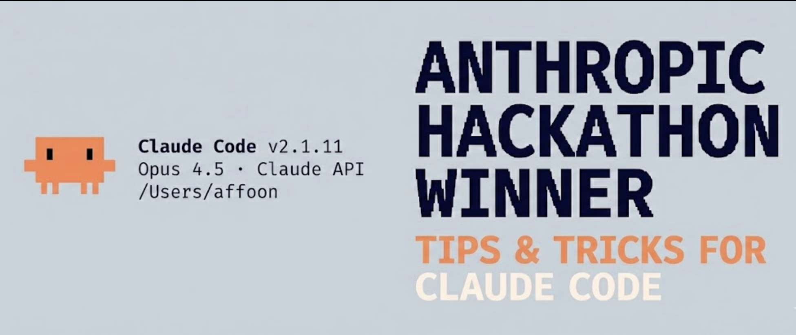
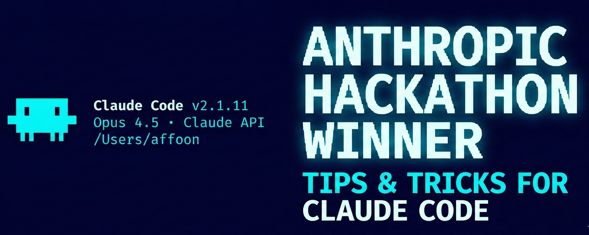

**Idioma:** [English](README.md) | **Português (Brasil)** | [简体中文](README.zh-CN.md) | [繁體中文](docs/zh-TW/README.md) | [日本語](docs/ja-JP/README.md) | [한국어](docs/ko-KR/README.md) | [Türkçe](docs/tr/README.md) | [Русский](docs/ru/README.md) | [Tiếng Việt](docs/vi-VN/README.md) | [ไทย](docs/th/README.md) | [Deutsch](docs/de-DE/README.md) | [Español](docs/es/README.md)


[](https://github.com/affaan-m/ECC/stargazers)
[](https://github.com/affaan-m/ECC/network/members)
[](https://github.com/affaan-m/ECC/graphs/contributors)
[](https://www.npmjs.com/package/ecc-universal)
[](https://www.npmjs.com/package/ecc-agentshield)
[](https://github.com/marketplace/ecc-tools)
[](LICENSE)


> [!WARNING]
> **Apenas fontes oficiais.** Instale o ECC somente a partir de canais verificados: o repositório do GitHub [github.com/affaan-m/ECC](https://github.com/affaan-m/ECC), os pacotes npm [`ecc-universal`](https://www.npmjs.com/package/ecc-universal) e [`ecc-agentshield`](https://www.npmjs.com/package/ecc-agentshield), o [GitHub App](https://github.com/apps/ecc-tools), o slug de plugin `ecc@ecc` e o site oficial do projeto [ecc.tools](https://ecc.tools). Reuploads de terceiros e espelhos não oficiais não são mantidos nem revisados pelo projeto e podem conter malware.

**211.9K+ stars** | **32.5K+ forks** | **230+ contribuidores** | **12+ ecossistemas de linguagem** | **Fluxos de trabalho de agentes cross-harness**

---

<div align="center">

**Language / 语言 / 語言 / Dil / Язык / Ngôn ngữ / Idioma**

[**English**](README.md) | [Português (Brasil)](docs/pt-BR/README.md) | [简体中文](README.zh-CN.md) | [繁體中文](docs/zh-TW/README.md) | [日本語](docs/ja-JP/README.md) | [한국어](docs/ko-KR/README.md)
 | [Türkçe](docs/tr/README.md) | [Русский](docs/ru/README.md) | [Tiếng Việt](docs/vi-VN/README.md) | [ไทย](docs/th/README.md) | [Deutsch](docs/de-DE/README.md) | [Español](docs/es/README.md)

</div>

---

**O sistema operador harness-nativo para trabalho com agentes. Construído a partir de fluxos de trabalho reais de engenharia multi-harness.**

Não são apenas configurações. Um sistema completo: skills, instintos, otimização de memória, aprendizado contínuo, varredura de segurança e desenvolvimento research-first. Agents, skills, hooks, regras, configurações de MCP e shims de comandos legados prontos para produção, evoluídos ao longo de mais de 10 meses de uso intensivo diário construindo produtos reais.

Funciona em **Codex**, **Claude Code**, **Cursor**, **OpenCode**, **Gemini**, **Zed**, **GitHub Copilot** e outros harnesses de agentes de IA.

O ECC v2.0.0 adiciona a história pública do operador Hermes sobre essa camada reutilizável: comece pelo [guia de configuração do Hermes](docs/HERMES-SETUP.md), depois revise as [notas de versão da 2.0.0](docs/releases/2.0.0/release-notes.md) e a [arquitetura cross-harness](docs/architecture/cross-harness.md).

---

<table>
<tr>
<td width="25%" align="center">
  <a href="https://ecc.tools/pricing">
    <strong> ECC Pro</strong><br />
    <sub>Repositórios privados · GitHub App · US$ 19/assento/mês</sub>
  </a>
</td>
<td width="25%" align="center">
  <a href="https://github.com/sponsors/affaan-m">
    <strong> Sponsor</strong><br />
    <sub>Financie o OSS · A partir de US$ 5/mês</sub>
  </a>
</td>
<td width="25%" align="center">
  <a href="https://github.com/affaan-m/ECC/discussions">
    <strong>Comunidade</strong>
    <br />
    <sub>Discussões · Perguntas e respostas · Show & Tell</sub>
  </a>
</td>
<td width="25%" align="center">
  <a href="https://github.com/apps/ecc-tools">
    <strong> GitHub App</strong><br />
    <sub>Instalar · Auditorias de PR · Plano gratuito</sub>
  </a>
</td>
</tr>
</table>

<sub>**O OSS continua gratuito.** Este repositório é licenciado sob MIT para sempre. O ECC Pro é o GitHub App hospedado para repositórios privados. <a href="https://github.com/sponsors/affaan-m">Sponsors</a> e <a href="https://ecc.tools/pricing">assinantes Pro</a> financiam o trabalho — é por isso que um único mantenedor entrega semanalmente em 7 harnesses.</sub>

<div align="center">

<sub><strong>Patrocinadores empresariais</strong></sub>

<table>
<tr>
<td align="center" width="220">
  <a href="https://www.coderabbit.ai">
    <br />
    <strong>CodeRabbit</strong>
  </a>
</td>
<td align="center" width="220">
  <a href="https://www.greptile.com/go/ecc">
    <br />
    <strong>Greptile</strong>
  </a>
</td>
<td align="center" width="220">
  <a href="https://www.atlascloud.ai/?utm_source=github&utm_medium=link&utm_campaign=ECC">
    <br />
    <strong>Atlas Cloud</strong>
  </a>
</td>
</tr>
</table>

<sub><strong>Patrocinadores da comunidade:</strong> <a href="https://github.com/mikejmorgan-ai">Mike Morgan</a> · <a href="https://github.com/jasonwu513">@jasonwu513</a> · <a href="https://github.com/1anter">@1anter</a> · <a href="https://github.com/massimotodaro">@massimotodaro</a> · <a href="https://github.com/meadmccabe">@meadmccabe</a></sub>

<sub><a href="https://github.com/sponsors/affaan-m"><strong>Torne-se um Sponsor</strong></a> · <a href="SPONSORS.md">Níveis de patrocínio</a> · <a href="SPONSORING.md">Programa de patrocínio</a></sub>

</div>

---

## Os Guias

Este repositório contém apenas o código bruto. Os guias explicam tudo.

<table>
<tr>
<td width="50%" align="center">
<a href="./the-shortform-guide.md">
<br />
<b>O Guia Resumido</b>
</a>
<br /><sub>Configuração, fundamentos, filosofia. <b>Leia isto primeiro.</b> (<a href="https://x.com/affaan/status/2012378465664745795">thread</a>)</sub>
</td>
<td width="50%" align="center">
<a href="./the-longform-guide.md">
<br />
<b>O Guia Aprofundado</b>
</a>
<br /><sub>Otimização de tokens, persistência de memória, evals, paralelização. (<a href="https://x.com/affaan/status/2014040193557471352">thread</a>)</sub>
</td>
</tr>
</table>

<div align="center">
<a href="./the-security-guide.md">
<br />
<b>O Guia de Segurança</b>
</a>
<br /><sub>Vetores de ataque, sandboxing, sanitização, CVEs, AgentShield. (<a href="https://x.com/affaan/status/2033263813387223421">thread</a>)</sub>
</div>

| Tópico | O que você vai aprender |
|-------|-------------------|
| Otimização de tokens | Seleção de modelo, enxugamento do system prompt, processos em segundo plano |
| Persistência de memória | Hooks que salvam/carregam contexto entre sessões automaticamente |
| Aprendizado contínuo | Extração automática de padrões das sessões em skills reutilizáveis |
| Loops de verificação | Evals de checkpoint vs. contínuos, tipos de grader, métricas pass@k |
| Paralelização | Git worktrees, método cascade, quando escalar instâncias |
| Orquestração de subagentes | O problema de contexto, padrão de recuperação iterativa |

---

## Novidades

### v2.0.0 — O Sistema Operacional para Harness de Agentes (jun. 2026)

Graduação estável da linha 2.0: 261 skills, o substrato do painel de controle (adaptadores de sessão + inventário de MCP), o serviço de ciclo de vida de worktree, a família de orquestradores `orch-*` e o lançamento da [comunidade ECC no Discord](https://discord.gg/36yGMHGFbR). Notas completas: [docs/releases/2.0.0/release-notes.md](docs/releases/2.0.0/release-notes.md).

### v2.0.0-rc.1 — Renovação da Superfície, Fluxos de Trabalho de Operador e ECC 2.0 Alpha (abr. 2026)

- **Interface gráfica do Dashboard** — Nova aplicação desktop baseada em Tkinter (`ecc_dashboard.py` ou `npm run dashboard`) com alternância de tema claro/escuro, personalização de fontes e o logotipo do projeto no cabeçalho e na barra de tarefas.
- **Superfície pública sincronizada com o repositório ativo** — metadados, contagens de catálogo, manifestos de plugin e docs voltadas à instalação agora correspondem à superfície OSS real: 66 agents, 268 skills e 84 shims de comandos legados.
- **Expansão dos fluxos de trabalho de operador e outbound** — `brand-voice`, `social-graph-ranker`, `connections-optimizer`, `customer-billing-ops`, `ecc-tools-cost-audit`, `google-workspace-ops`, `project-flow-ops` e `workspace-surface-audit` completam a trilha do operador.
- **Ferramentas de mídia e lançamento** — `manim-video`, `remotion-video-creation` e superfícies aprimoradas de publicação social tornam explicativos técnicos e conteúdo de lançamento parte do mesmo sistema.
- **Crescimento da superfície de frameworks e produtos** — `nestjs-patterns`, superfícies de instalação Codex/OpenCode mais ricas e empacotamento cross-harness ampliado mantêm o repositório útil além do Claude Code isoladamente.
- **Pacote de skills do mercado de previsões Itô** — `ito-market-intelligence`, `ito-basket-compare`, `ito-trade-planner`, `ito-data-atlas-agent`, `prediction-market-oracle-research` e `prediction-market-risk-review` adicionam fluxos de trabalho públicos e não consultivos de mercado/cesta, mantendo o acesso à API ativa da Itô restrito e separado da cobrança do ECC Tools.
- **Pacote de skills de otimização** — `parallel-execution-optimizer`, `benchmark-optimization-loop`, `data-throughput-accelerator`, `latency-critical-systems` e `recursive-decision-ledger` transformam prompts repetidos de velocidade/recursão em fluxos de trabalho limitados de benchmark, throughput e ledger de decisão.
- **O ECC 2.0 alpha está in-tree** — o protótipo do plano de controle em Rust em `ecc2/` agora compila localmente e expõe os comandos `dashboard`, `start`, `sessions`, `status`, `stop`, `resume` e `daemon`. É utilizável como alpha, ainda não como release geral.
- **Snapshots de status do operador** — `ecc status --markdown --write status.md` transforma o store de estado local em um handoff portátil que cobre prontidão, sessões ativas, saúde de execução de skills, saúde de instalação, eventos de governança pendentes e itens de trabalho vinculados do Linear/GitHub/handoffs. Use `ecc work-items upsert ...` para entradas manuais, `ecc work-items sync-github --repo owner/repo` para o estado da fila de PRs/issues e `ecc status --exit-code` para falhar a automação quando a prontidão exigir atenção.
- **Endurecimento do ecossistema** — AgentShield, controles de custo do ECC Tools, trabalho no portal de cobrança e renovações do site continuam a ser entregues em torno do plugin central, em vez de se dispersarem em silos separados.

### v1.9.0 — Instalação Seletiva e Expansão de Linguagens (mar. 2026)

- **Arquitetura de instalação seletiva** — Pipeline de instalação orientado por manifesto com `install-plan.js` e `install-apply.js` para instalação direcionada de componentes. O store de estado rastreia o que está instalado e habilita atualizações incrementais.
- **6 novos agents** — `typescript-reviewer`, `pytorch-build-resolver`, `java-build-resolver`, `java-reviewer`, `kotlin-reviewer`, `kotlin-build-resolver` ampliam a cobertura de linguagens para 10 linguagens.
- **Novas skills** — `pytorch-patterns` para fluxos de trabalho de deep learning, `documentation-lookup` para pesquisa de referência de API, `bun-runtime` e `nextjs-turbopack` para toolchains JS modernas, além de 8 skills de domínio operacional e `mcp-server-patterns`.
- **Infraestrutura de sessão e estado** — Store de estado SQLite com CLI de consulta, adaptadores de sessão para gravação estruturada, base de evolução de skills para skills que se autoaperfeiçoam.
- **Revisão da orquestração** — Pontuação de auditoria de harness tornada determinística, status de orquestração e compatibilidade de launcher endurecidos, prevenção de loop do observador com guarda de 5 camadas.
- **Confiabilidade do observador** — Correção de explosão de memória com throttling e amostragem de cauda, correção de acesso ao sandbox, lógica de início preguiçoso (lazy-start) e guarda de reentrância.
- **12 ecossistemas de linguagem** — Novas regras para Java, PHP, Perl, Kotlin/Android/KMP, C++ e Rust se juntam às regras existentes de TypeScript, Python, Go e às regras comuns.
- **Contribuições da comunidade** — Traduções para coreano e chinês, otimização do hook do biome, skills de processamento de vídeo, skills operacionais, instalador PowerShell, suporte ao Antigravity IDE.
- **Endurecimento de CI/CD** — 19 correções de falhas de teste, aplicação da contagem de catálogo, validação do manifesto de instalação e suíte de testes completa em verde.

### v1.8.0 — Sistema de Performance de Harness (mar. 2026)

- **Release harness-first** — O ECC agora é explicitamente apresentado como um sistema de performance de harness de agentes, e não apenas um pacote de configurações.
- **Revisão da confiabilidade de hooks** — Fallback de raiz no SessionStart, resumos de sessão na fase Stop e hooks baseados em scripts substituindo one-liners inline frágeis.
- **Controles de runtime de hooks** — `ECC_HOOK_PROFILE=minimal|standard|strict` e `ECC_DISABLED_HOOKS=...` para gating em runtime sem editar os arquivos de hook.
- **Novos comandos de harness** — `/harness-audit`, `/loop-start`, `/loop-status`, `/quality-gate`, `/model-route`.
- **NanoClaw v2** — roteamento de modelo, hot-load de skills, branch/busca/exportação/compactação/métricas de sessão.
- **Paridade cross-harness** — comportamento ajustado entre Claude Code, Cursor, OpenCode e Codex app/CLI.
- **997 testes internos passando** — suíte completa em verde após a refatoração de hook/runtime e atualizações de compatibilidade.

### v1.7.0 — Expansão Multiplataforma e Construtor de Apresentações (fev. 2026)

- **Suporte ao Codex app + CLI** — Suporte direto ao Codex baseado em `AGENTS.md`, direcionamento do instalador e docs do Codex
- **Skill `frontend-slides`** — Construtor de apresentações HTML sem dependências, com orientação de conversão para PPTX e regras estritas de ajuste à viewport
- **5 novas skills genéricas de negócios/conteúdo** — `article-writing`, `content-engine`, `market-research`, `investor-materials`, `investor-outreach`
- **Cobertura de ferramentas mais ampla** — Suporte a Cursor, Codex e OpenCode ajustado para que o mesmo repositório seja entregue de forma limpa em todos os principais harnesses
- **992 testes internos** — Cobertura de validação e regressão expandida em plugin, hooks, skills e empacotamento

### v1.6.0 — Codex CLI, AgentShield e Marketplace (fev. 2026)

- **Suporte ao Codex CLI** — O novo comando `/codex-setup` gera `codex.md` para compatibilidade com o OpenAI Codex CLI
- **7 novas skills** — `search-first`, `swift-actor-persistence`, `swift-protocol-di-testing`, `regex-vs-llm-structured-text`, `content-hash-cache-pattern`, `cost-aware-llm-pipeline`, `skill-stocktake`
- **Integração com AgentShield** — A skill `/security-scan` executa o AgentShield diretamente do Claude Code; 1282 testes, 102 regras
- **GitHub Marketplace** — O ECC Tools GitHub App está no ar em [github.com/marketplace/ecc-tools](https://github.com/marketplace/ecc-tools) com níveis free/pro/enterprise
- **30+ PRs da comunidade mesclados** — Contribuições de 30 contribuidores em 6 linguagens
- **978 testes internos** — Suíte de validação expandida em agents, skills, comandos, hooks e regras

### v1.4.1 — Correção de Bug (fev. 2026)

- **Corrigida a perda de conteúdo na importação de instintos** — `parse_instinct_file()` estava silenciosamente descartando todo o conteúdo após o frontmatter (seções Action, Evidence, Examples) durante `/instinct-import`. ([#148](https://github.com/affaan-m/ECC/issues/148), [#161](https://github.com/affaan-m/ECC/pull/161))

### v1.4.0 — Regras Multilíngue, Assistente de Instalação e PM2 (fev. 2026)

- **Assistente interativo de instalação** — A nova skill `configure-ecc` fornece configuração guiada com detecção de merge/sobrescrita
- **PM2 e orquestração multiagente** — 6 novos comandos (`/pm2`, `/multi-plan`, `/multi-execute`, `/multi-backend`, `/multi-frontend`, `/multi-workflow`) para gerenciar fluxos de trabalho complexos de múltiplos serviços
- **Arquitetura de regras multilíngue** — Regras reestruturadas de arquivos planos para os diretórios `common/` + `typescript/` + `python/` + `golang/`. Instale apenas as linguagens de que você precisa
- **Traduções para chinês (zh-CN)** — Tradução completa de todos os agents, comandos, skills e regras (80+ arquivos)
- **Suporte a GitHub Sponsors** — Patrocine o projeto via GitHub Sponsors
- **CONTRIBUTING.md aprimorado** — Templates detalhados de PR para cada tipo de contribuição

### v1.3.0 — Suporte ao Plugin OpenCode (fev. 2026)

- **Integração completa com OpenCode** — 12 agents, 24 comandos, 16 skills com suporte a hooks via sistema de plugins do OpenCode (20+ tipos de eventos)
- **3 ferramentas personalizadas nativas** — run-tests, check-coverage, security-audit
- **Documentação para LLM** — `llms.txt` para docs abrangentes do OpenCode

### v1.2.0 — Comandos e Skills Unificados (fev. 2026)

- **Suporte a Python/Django** — Skills de padrões, segurança, TDD e verificação para Django
- **Skills de Java Spring Boot** — Padrões, segurança, TDD e verificação para Spring Boot
- **Gerenciamento de sessão** — Comando `/sessions` para histórico de sessões
- **Aprendizado contínuo v2** — Aprendizado baseado em instintos com pontuação de confiança, importação/exportação, evolução

Veja o changelog completo em [Releases](https://github.com/affaan-m/ECC/releases).

---

## Início Rápido

Coloque tudo em funcionamento em menos de 2 minutos:

### Escolha apenas um caminho

A maioria dos usuários do Claude Code deve usar exatamente um caminho de instalação:

- **Padrão recomendado:** instale o plugin do Claude Code e depois copie apenas as pastas de regras que você realmente quer.
- **Use o instalador manual somente se** você quiser controle mais granular, quiser evitar totalmente o caminho do plugin ou sua build do Claude Code tiver dificuldade em resolver a entrada de marketplace auto-hospedada.
- **Não empilhe métodos de instalação.** A configuração quebrada mais comum é: rodar `/plugin install` primeiro e, depois, `install.sh --profile full` ou `npx ecc-install --profile full`.

Se você já sobrepôs várias instalações e tudo parece duplicado, pule direto para [Resetar / Desinstalar o ECC](#reset--uninstall-ecc).

### Caminho de baixo contexto / sem hooks

Se os hooks parecerem globais demais ou você quiser apenas as regras, agents, comandos e skills de fluxo de trabalho central do ECC, pule o plugin e use o perfil manual mínimo:

```bash
./install.sh --profile minimal --target claude
```

```powershell
.\install.ps1 --profile minimal --target claude
# ou
npx ecc-install --profile minimal --target claude
```

Esse perfil exclui intencionalmente `hooks-runtime`.

Se você quiser o perfil core normal, mas precisar dos hooks desligados, use:

```bash
./install.sh --profile core --without baseline:hooks --target claude
```

Adicione os hooks depois somente se quiser aplicação em runtime:

```bash
./install.sh --target claude --modules hooks-runtime
```

### Encontre os componentes certos primeiro

Se você não tem certeza de qual perfil ou componente do ECC instalar, pergunte ao consultor empacotado a partir de qualquer projeto:

```bash
npx ecc consult "security reviews" --target claude
```

Ele retorna componentes correspondentes, perfis relacionados e comandos de preview/instalação. Use o comando de preview antes de instalar se quiser inspecionar o plano exato de arquivos.

Para fluxos de trabalho de ML/MLOps em produção, mantenha a instalação opt-in e com escopo por componente:

```bash
npx ecc consult "mlops training model deployment" --target claude
npx ecc install --profile minimal --target claude --with capability:machine-learning
```

### Passo 1: Instale o Plugin (Recomendado)

> NOTA: O plugin é conveniente, mas o instalador OSS abaixo ainda é o caminho mais confiável se sua build do Claude Code tiver dificuldade em resolver entradas de marketplace auto-hospedadas.

```bash
# Adicionar marketplace
/plugin marketplace add https://github.com/affaan-m/ECC

# Instalar plugin
/plugin install ecc@ecc
```

### Nota sobre Nomenclatura + Migração

O ECC agora tem três identificadores públicos, e eles não são intercambiáveis:

- Repositório-fonte no GitHub: `affaan-m/ECC`
- Identificador de marketplace/plugin do Claude: `ecc@ecc`
- Pacote npm: `ecc-universal`

Isso é intencional. As instalações de marketplace/plugin da Anthropic são indexadas por um identificador canônico de plugin, então o ECC usa `ecc@ecc` para manter os nomes de ferramentas e os namespaces de slash-command curtos o suficiente para validadores estritos de Desktop/API. Posts mais antigos ainda podem mostrar o antigo identificador de marketplace longo; trate-o apenas como um alias legado. Separadamente, o pacote npm permaneceu como `ecc-universal`, então instalações via npm e via marketplace usam intencionalmente nomes diferentes.

### Passo 2: Instale as Regras Apenas Se Você Precisar Delas

> WARNING: **Importante:** Os plugins do Claude Code não conseguem distribuir `rules` automaticamente.
>
> Se você já instalou o ECC via `/plugin install`, **não execute `./install.sh --profile full`, `.\install.ps1 --profile full` nem `npx ecc-install --profile full` depois disso**. O plugin já carrega skills, comandos e hooks do ECC. Executar o instalador completo após uma instalação de plugin copia essas mesmas superfícies para seus diretórios de usuário e pode criar skills duplicadas além de comportamento de runtime duplicado.
>
> Para instalações via plugin, copie manualmente apenas os diretórios de `rules/` que você quer para dentro de `~/.claude/rules/ecc/`. Comece com `rules/common` mais um pacote de linguagem ou framework que você realmente use. Não copie todos os diretórios de regras a menos que queira explicitamente todo esse contexto no Claude.
>
> Use o instalador completo apenas quando estiver fazendo uma instalação totalmente manual do ECC em vez do caminho do plugin.
>
> Se sua configuração local do Claude foi apagada ou resetada, isso não significa que você precisa comprar o ECC novamente. Comece com `node scripts/ecc.js list-installed`, depois execute `node scripts/ecc.js doctor` e `node scripts/ecc.js repair` antes de reinstalar qualquer coisa. Isso normalmente restaura os arquivos gerenciados pelo ECC sem reconstruir sua configuração. Se o problema for acesso à conta ou ao marketplace para o ECC Tools, trate a recuperação de cobrança/conta separadamente.

```bash
# Clone o repositório primeiro
git clone https://github.com/affaan-m/ECC.git
cd ECC

# Instale as dependências (escolha seu gerenciador de pacotes)
npm install        # ou: pnpm install | yarn install | bun install

# Caminho de instalação por plugin: copie apenas as regras do ECC para um namespace próprio do ECC
mkdir -p ~/.claude/rules/ecc
cp -R rules/common ~/.claude/rules/ecc/
cp -R rules/typescript ~/.claude/rules/ecc/

# Caminho de instalação totalmente manual do ECC (use isto em vez de /plugin install)
# ./install.sh --profile full
```

```powershell
# Windows PowerShell

# Caminho de instalação por plugin: copie apenas as regras do ECC para um namespace próprio do ECC
New-Item -ItemType Directory -Force -Path "$HOME/.claude/rules/ecc" | Out-Null
Copy-Item -Recurse rules/common "$HOME/.claude/rules/ecc/"
Copy-Item -Recurse rules/typescript "$HOME/.claude/rules/ecc/"

# Caminho de instalação totalmente manual do ECC (use isto em vez de /plugin install)
# .\install.ps1 --profile full
# npx ecc-install --profile full
```

Para instruções de instalação manual, veja o README na pasta `rules/`. Ao copiar regras manualmente, copie o diretório de linguagem inteiro (por exemplo `rules/common` ou `rules/golang`), e não os arquivos dentro dele, para que as referências relativas continuem funcionando e os nomes de arquivo não colidam.

### Instalação totalmente manual (Fallback)

Use isto apenas se você estiver pulando intencionalmente o caminho do plugin:

```bash
./install.sh --profile full
```

```powershell
.\install.ps1 --profile full
# ou
npx ecc-install --profile full
```

Se você escolher esse caminho, pare aí. Não execute também `/plugin install`.

### Reset / Uninstall ECC

Se o ECC parecer duplicado, intrusivo ou quebrado, não fique reinstalando-o sobre si mesmo.

- **Caminho do plugin:** remova o plugin do Claude Code, depois exclua as pastas de regras específicas que você copiou manualmente para `~/.claude/rules/ecc/`.
- **Caminho do instalador manual / CLI:** a partir da raiz do repositório, faça primeiro um preview da remoção:

```bash
node scripts/uninstall.js --dry-run
```

Depois remova os arquivos gerenciados pelo ECC:

```bash
node scripts/uninstall.js
```

Você também pode usar o wrapper de ciclo de vida:

```bash
node scripts/ecc.js list-installed
node scripts/ecc.js doctor
node scripts/ecc.js repair
node scripts/ecc.js uninstall --dry-run
```

O ECC remove apenas os arquivos registrados em seu install-state. Ele não excluirá arquivos não relacionados que não tenha instalado.

Se você empilhou métodos, faça a limpeza nesta ordem:

1. Remova a instalação do plugin do Claude Code.
2. Execute o comando de uninstall do ECC a partir da raiz do repositório para remover os arquivos gerenciados pelo install-state.
3. Exclua quaisquer pastas de regras extras que você copiou manualmente e não quer mais.
4. Reinstale uma única vez, usando um único caminho.

### Passo 3: Comece a Usar

```bash
# Skills são a principal superfície de fluxo de trabalho.
# Os nomes de comandos no estilo slash existentes ainda funcionam enquanto o ECC migra para fora de commands/.

# A instalação por plugin usa a forma canônica com namespace
/ecc:plan "Add user authentication"

# A instalação manual mantém a forma slash mais curta:
# /plan "Add user authentication"

# Verifique os comandos disponíveis
/plugin list ecc@ecc
```

**É isso!** Agora você tem acesso a 67 agents, 271 skills e 92 shims de comandos legados.

### Interface Gráfica do Dashboard

Inicie o dashboard de desktop para explorar visualmente os componentes do ECC:

```bash
npm run dashboard
# ou
python3 ./ecc_dashboard.py
```

**Recursos:**
- Interface em abas: Agents, Skills, Comandos, Regras, Configurações
- Alternância de tema Claro/Escuro
- Personalização de fontes (família e tamanho)
- Logotipo do projeto no cabeçalho e na barra de tarefas
- Busca e filtro em todos os componentes

### Comandos multimodelo exigem configuração adicional

> WARNING: Os comandos `multi-*` **não** são cobertos pela instalação base de plugin/regras acima.
>
> Para usar `/multi-plan`, `/multi-execute`, `/multi-backend`, `/multi-frontend` e `/multi-workflow`, você também precisa instalar o runtime `ccg-workflow`.
>
> Inicialize-o com `npx ccg-workflow`.
>
> Esse runtime fornece as dependências externas que esses comandos esperam, incluindo:
> - `~/.claude/bin/codeagent-wrapper`
> - `~/.claude/.ccg/prompts/*`
>
> Sem o `ccg-workflow`, esses comandos `multi-*` não serão executados corretamente.

---

## Suporte Multiplataforma

Este plugin agora oferece suporte completo a **Windows, macOS e Linux**, junto com integração estreita com as principais IDEs (Cursor, Zed, OpenCode, Antigravity) e harnesses de CLI. Todos os hooks e scripts foram reescritos em Node.js para máxima compatibilidade.

### Detecção do Gerenciador de Pacotes

O plugin detecta automaticamente seu gerenciador de pacotes preferido (npm, pnpm, yarn ou bun) com a seguinte prioridade:

1. **Variável de ambiente**: `CLAUDE_PACKAGE_MANAGER`
2. **Configuração do projeto**: `.claude/package-manager.json`
3. **package.json**: campo `packageManager`
4. **Arquivo de lock**: Detecção a partir de package-lock.json, yarn.lock, pnpm-lock.yaml ou bun.lockb
5. **Configuração global**: `~/.claude/package-manager.json`
6. **Fallback**: Primeiro gerenciador de pacotes disponível

Para definir seu gerenciador de pacotes preferido:

```bash
# Via variável de ambiente
export CLAUDE_PACKAGE_MANAGER=pnpm

# Via configuração global
node scripts/setup-package-manager.js --global pnpm

# Via configuração do projeto
node scripts/setup-package-manager.js --project bun

# Detectar a configuração atual
node scripts/setup-package-manager.js --detect
```

Ou use o comando `/setup-pm` no Claude Code.

### Controles de Runtime de Hooks

Use flags de runtime para ajustar a rigidez ou desabilitar hooks específicos temporariamente:

```bash
# Perfil de rigidez de hooks (padrão: standard)
export ECC_HOOK_PROFILE=standard

# IDs de hooks separados por vírgula para desabilitar
export ECC_DISABLED_HOOKS="pre:bash:tmux-reminder,post:edit:typecheck"

# Limite do contexto adicional do SessionStart (padrão: 8000 caracteres)
export ECC_SESSION_START_MAX_CHARS=4000

# Desabilita totalmente o contexto adicional do SessionStart para setups de baixo contexto/modelo local
export ECC_SESSION_START_CONTEXT=off

# Janela de retenção de session-tmp em dias (padrão: 30).
# Defina como 0, off, false, disabled, never ou none para manter todas as sessões (desabilitar a poda).
export ECC_SESSION_RETENTION_DAYS=14

# Mantém os avisos de contexto/escopo/loop, mas suprime estimativas de custo por taxa de API
export ECC_CONTEXT_MONITOR_COST_WARNINGS=off
```

Windows PowerShell:

```powershell
[Environment]::SetEnvironmentVariable('ECC_CONTEXT_MONITOR_COST_WARNINGS', 'off', 'User')
[Environment]::SetEnvironmentVariable('ECC_SESSION_RETENTION_DAYS', '14', 'User')
```

### Diretório de dados do agente (isolamento multi-harness)

Os hooks de persistência de memória (resumos de sessão, skills aprendidas, aliases de sessão, métricas) armazenam dados sob uma única raiz de dados do agente. Por padrão, essa raiz é `~/.claude`. Quando você usa o ECC tanto no Claude Code quanto no Cursor na mesma máquina, defina uma raiz separada para o Cursor para que os dois ambientes não sobrescrevam os arquivos de sessão um do outro:

```bash
# Limite só para o Cursor (o Claude Code mantém o padrão ~/.claude)
export ECC_AGENT_DATA_HOME="$HOME/.cursor/ecc"
```

Os caminhos resolvidos sob essa raiz incluem:

- `$ECC_AGENT_DATA_HOME/session-data/` — resumos de sessão
- `$ECC_AGENT_DATA_HOME/skills/learned/` — skills aprendidas pelo evaluate-session
- `$ECC_AGENT_DATA_HOME/session-aliases.json` — aliases de sessão
- `$ECC_AGENT_DATA_HOME/metrics/` — métricas de custo e atividade

Veja [affaan-m/ECC#2065](https://github.com/affaan-m/ECC/issues/2065).

---

## O Que Há Dentro

Este repositório é um **plugin do Claude Code** - instale-o diretamente ou copie componentes manualmente.

```
ECC/
|-- .claude-plugin/   # Manifestos de plugin e marketplace
|   |-- plugin.json         # Metadados do plugin e caminhos de componentes
|   |-- marketplace.json    # Catálogo de marketplace para /plugin marketplace add
|
|-- agents/           # 67 subagentes especializados para delegação
|   |-- planner.md           # Planejamento de implementação de feature
|   |-- architect.md         # Decisões de design de sistema
|   |-- tdd-guide.md         # Desenvolvimento orientado a testes
|   |-- code-reviewer.md     # Review de qualidade e segurança
|   |-- security-reviewer.md # Análise de vulnerabilidades
|   |-- build-error-resolver.md
|   |-- e2e-runner.md        # Testes E2E com Playwright
|   |-- refactor-cleaner.md  # Limpeza de código morto
|   |-- doc-updater.md        # Sincronização de documentação
|   |-- docs-lookup.md       # Consulta de documentação/API
|   |-- chief-of-staff.md    # Triagem de comunicação e rascunhos
|   |-- loop-operator.md     # Execução autônoma de loop
|   |-- harness-optimizer.md # Ajuste de configuração de harness
|   |-- cpp-reviewer.md      # Review de código C++
|   |-- cpp-build-resolver.md # Resolução de erros de build em C++
|   |-- fsharp-reviewer.md   # Review de código funcional F#
|   |-- go-reviewer.md       # Review de código Go
|   |-- go-build-resolver.md # Resolução de erros de build em Go
|   |-- python-reviewer.md   # Review de código Python
|   |-- database-reviewer.md # Review de banco de dados/Supabase
|   |-- typescript-reviewer.md # Review de código TypeScript/JavaScript
|   |-- java-reviewer.md     # Review de código Java/Spring Boot
|   |-- java-build-resolver.md # Erros de build Java/Maven/Gradle
|   |-- kotlin-reviewer.md   # Review de código Kotlin/Android/KMP
|   |-- kotlin-build-resolver.md # Erros de build Kotlin/Gradle
|   |-- harmonyos-app-resolver.md # Desenvolvimento de apps HarmonyOS/ArkTS
|   |-- rust-reviewer.md     # Review de código Rust
|   |-- rust-build-resolver.md # Resolução de erros de build em Rust
|   |-- pytorch-build-resolver.md # Erros de treinamento PyTorch/CUDA
|   |-- mle-reviewer.md      # Review de pipeline de ML em produção, eval, serving e monitoramento
|
|-- skills/           # Definições de fluxo de trabalho e conhecimento de domínio
|   |-- coding-standards/           # Boas práticas de linguagem
|   |-- clickhouse-io/              # Analytics ClickHouse, queries, engenharia de dados
|   |-- backend-patterns/           # Padrões de API, banco de dados, caching
|   |-- frontend-patterns/          # Padrões de React, Next.js
|   |-- frontend-slides/            # Decks de slides HTML e fluxos de PPTX-para-web (NEW)
|   |-- article-writing/            # Escrita long-form em uma voz fornecida sem o tom genérico de IA (NEW)
|   |-- content-engine/             # Conteúdo social multiplataforma e fluxos de reaproveitamento (NEW)
|   |-- market-research/            # Pesquisa de mercado, concorrentes e investidores com atribuição de fontes (NEW)
|   |-- investor-materials/         # Pitch decks, one-pagers, memos e modelos financeiros (NEW)
|   |-- investor-outreach/          # Abordagem personalizada de captação e follow-up (NEW)
|   |-- continuous-learning/        # Padrão legado v1 de extração via Stop-hook
|   |-- continuous-learning-v2/     # Aprendizado baseado em instintos com pontuação de confiança
|   |-- iterative-retrieval/        # Refinamento progressivo de contexto para subagentes
|   |-- strategic-compact/          # Sugestões manuais de compactação (Guia Aprofundado)
|   |-- tdd-workflow/               # Metodologia TDD
|   |-- security-review/            # Checklist de segurança
|   |-- eval-harness/               # Avaliação de loop de verificação (Guia Aprofundado)
|   |-- verification-loop/          # Verificação contínua (Guia Aprofundado)
|   |-- videodb/                   # Vídeo e áudio: ingest, busca, edição, geração, stream (NEW)
|   |-- golang-patterns/            # Idiomas Go e boas práticas
|   |-- golang-testing/             # Padrões de teste Go, TDD, benchmarks
|   |-- cpp-coding-standards/         # Padrões de código C++ das C++ Core Guidelines (NEW)
|   |-- cpp-testing/                # Testes C++ com GoogleTest, CMake/CTest (NEW)
|   |-- django-patterns/            # Padrões Django, models, views (NEW)
|   |-- django-security/            # Boas práticas de segurança Django (NEW)
|   |-- django-tdd/                 # Fluxo de trabalho TDD Django (NEW)
|   |-- django-verification/        # Loops de verificação Django (NEW)
|   |-- laravel-patterns/           # Padrões de arquitetura Laravel (NEW)
|   |-- laravel-security/           # Boas práticas de segurança Laravel (NEW)
|   |-- laravel-tdd/                # Fluxo de trabalho TDD Laravel (NEW)
|   |-- laravel-verification/       # Loops de verificação Laravel (NEW)
|   |-- python-patterns/            # Idiomas Python e boas práticas (NEW)
|   |-- python-testing/             # Testes Python com pytest (NEW)
|   |-- quarkus-patterns/            # Padrões Java Quarkus (NEW)
|   |-- quarkus-security/            # Segurança Quarkus (NEW)
|   |-- quarkus-tdd/                 # TDD Quarkus (NEW)
|   |-- quarkus-verification/        # Verificação Quarkus (NEW)
|   |-- springboot-patterns/        # Padrões Java Spring Boot (NEW)
|   |-- springboot-security/        # Segurança Spring Boot (NEW)
|   |-- springboot-tdd/             # TDD Spring Boot (NEW)
|   |-- springboot-verification/    # Verificação Spring Boot (NEW)
|   |-- configure-ecc/              # Assistente interativo de instalação (NEW)
|   |-- security-scan/              # Integração com o auditor de segurança AgentShield (NEW)
|   |-- java-coding-standards/     # Padrões de código Java (NEW)
|   |-- jpa-patterns/              # Padrões JPA/Hibernate (NEW)
|   |-- postgres-patterns/         # Padrões de otimização PostgreSQL (NEW)
|   |-- nutrient-document-processing/ # Processamento de documentos com a API Nutrient (NEW)
|   |-- docs/examples/project-guidelines-template.md  # Template para skills específicas de projeto
|   |-- database-migrations/         # Padrões de migração (Prisma, Drizzle, Django, Go) (NEW)
|   |-- api-design/                  # Design de API REST, paginação, respostas de erro (NEW)
|   |-- deployment-patterns/         # CI/CD, Docker, health checks, rollbacks (NEW)
|   |-- docker-patterns/            # Docker Compose, redes, volumes, segurança de contêineres (NEW)
|   |-- e2e-testing/                 # Padrões E2E com Playwright e Page Object Model (NEW)
|   |-- content-hash-cache-pattern/  # Caching por hash de conteúdo SHA-256 para processamento de arquivos (NEW)
|   |-- cost-aware-llm-pipeline/     # Otimização de custo de LLM, roteamento de modelo, rastreamento de orçamento (NEW)
|   |-- regex-vs-llm-structured-text/ # Framework de decisão: regex vs. LLM para parsing de texto (NEW)
|   |-- swift-actor-persistence/     # Persistência de dados Swift thread-safe com actors (NEW)
|   |-- swift-protocol-di-testing/   # DI baseado em protocolo para código Swift testável (NEW)
|   |-- search-first/               # Fluxo de trabalho pesquisar-antes-de-codar (NEW)
|   |-- skill-stocktake/            # Auditoria de skills e comandos por qualidade (NEW)
|   |-- liquid-glass-design/         # Sistema de design Liquid Glass do iOS 26 (NEW)
|   |-- foundation-models-on-device/ # LLM on-device da Apple com FoundationModels (NEW)
|   |-- swift-concurrency-6-2/       # Approachable Concurrency do Swift 6.2 (NEW)
|   |-- mle-workflow/               # Contratos de dados, evals, deployment e monitoramento de ML em produção (NEW)
|   |-- perl-patterns/             # Idiomas e boas práticas do Perl 5.36+ moderno (NEW)
|   |-- perl-security/             # Padrões de segurança Perl, taint mode, I/O seguro (NEW)
|   |-- perl-testing/              # TDD Perl com Test2::V0, prove, Devel::Cover (NEW)
|   |-- autonomous-loops/           # Padrões de loop autônomo: pipelines sequenciais, loops de PR, orquestração DAG (NEW)
|   |-- plankton-code-quality/      # Aplicação de qualidade de código em tempo de escrita com hooks Plankton (NEW)
|   |-- codehealth-mcp/             # Skill MCP opcional do CodeScene Code Health (opt-in; não habilitada por padrão) (NEW)
|
|-- commands/         # Compatibilidade de entrada slash mantida; prefira skills/
|   |-- plan.md             # /plan - Planejamento de implementação
|   |-- code-review.md      # /code-review - Review de qualidade
|   |-- build-fix.md        # /build-fix - Corrigir erros de build
|   |-- refactor-clean.md   # /refactor-clean - Remoção de código morto
|   |-- quality-gate.md     # /quality-gate - Gate de verificação
|   |-- learn.md            # /learn - Extrair padrões no meio da sessão (Guia Aprofundado)
|   |-- learn-eval.md       # /learn-eval - Extrair, avaliar e salvar padrões (NEW)
|   |-- checkpoint.md       # /checkpoint - Salvar estado de verificação (Guia Aprofundado)
|   |-- setup-pm.md         # /setup-pm - Configurar gerenciador de pacotes
|   |-- go-review.md        # /go-review - Review de código Go (NEW)
|   |-- go-test.md          # /go-test - Fluxo de trabalho TDD Go (NEW)
|   |-- go-build.md         # /go-build - Corrigir erros de build Go (NEW)
|   |-- skill-create.md     # /skill-create - Gerar skills a partir do histórico do git (NEW)
|   |-- instinct-status.md  # /instinct-status - Ver instintos aprendidos (NEW)
|   |-- instinct-import.md  # /instinct-import - Importar instintos (NEW)
|   |-- instinct-export.md  # /instinct-export - Exportar instintos (NEW)
|   |-- evolve.md           # /evolve - Agrupar instintos em skills
|   |-- prune.md            # /prune - Excluir instintos pendentes expirados (NEW)
|   |-- pm2.md              # /pm2 - Gerenciamento do ciclo de vida de serviços PM2 (NEW)
|   |-- multi-plan.md       # /multi-plan - Decomposição de tarefas multiagente (NEW)
|   |-- multi-execute.md    # /multi-execute - Fluxos de trabalho multiagente orquestrados (NEW)
|   |-- multi-backend.md    # /multi-backend - Orquestração de múltiplos serviços de backend (NEW)
|   |-- multi-frontend.md   # /multi-frontend - Orquestração de múltiplos serviços de frontend (NEW)
|   |-- multi-workflow.md   # /multi-workflow - Fluxos de trabalho gerais de múltiplos serviços (NEW)
|   |-- sessions.md         # /sessions - Gerenciamento de histórico de sessões
|   |-- test-coverage.md    # /test-coverage - Análise de cobertura de testes
|   |-- update-docs.md      # /update-docs - Atualizar documentação
|   |-- update-codemaps.md  # /update-codemaps - Atualizar codemaps
|   |-- python-review.md    # /python-review - Review de código Python (NEW)
|-- legacy-command-shims/   # Arquivo opt-in para shims aposentados como /tdd e /eval
|   |-- tdd.md              # /tdd - Prefira a skill tdd-workflow
|   |-- e2e.md              # /e2e - Prefira a skill e2e-testing
|   |-- eval.md             # /eval - Prefira a skill eval-harness
|   |-- verify.md           # /verify - Prefira a skill verification-loop
|   |-- orchestrate.md      # /orchestrate - Prefira dmux-workflows ou multi-workflow
|
|-- rules/            # Diretrizes always-follow (copie para ~/.claude/rules/ecc/)
|   |-- README.md            # Visão geral da estrutura e guia de instalação
|   |-- common/              # Princípios agnósticos de linguagem
|   |   |-- coding-style.md    # Imutabilidade, organização de arquivos
|   |   |-- git-workflow.md    # Formato de commit, processo de PR
|   |   |-- testing.md         # TDD, requisito de 80% de cobertura
|   |   |-- performance.md     # Seleção de modelo, gerenciamento de contexto
|   |   |-- patterns.md        # Design patterns, projetos skeleton
|   |   |-- hooks.md           # Arquitetura de hooks, TodoWrite
|   |   |-- agents.md          # Quando delegar para subagentes
|   |   |-- security.md        # Verificações de segurança obrigatórias
|   |-- typescript/          # Específico de TypeScript/JavaScript
|   |-- python/              # Específico de Python
|   |-- golang/              # Específico de Go
|   |-- swift/               # Específico de Swift
|   |-- php/                 # Específico de PHP (NEW)
|   |-- arkts/               # Específico de HarmonyOS / ArkTS
|
|-- hooks/            # Automações baseadas em triggers
|   |-- README.md                 # Documentação de hooks, receitas e guia de personalização
|   |-- hooks.json                # Configuração de todos os hooks (PreToolUse, PostToolUse, Stop, etc.)
|   |-- memory-persistence/       # Hooks de ciclo de vida de sessão (Guia Aprofundado)
|   |-- strategic-compact/        # Sugestões de compactação (Guia Aprofundado)
|
|-- scripts/          # Scripts Node.js multiplataforma (NEW)
|   |-- lib/                     # Utilitários compartilhados
|   |   |-- utils.js             # Utilitários multiplataforma de arquivo/caminho/sistema
|   |   |-- package-manager.js   # Detecção e seleção de gerenciador de pacotes
|   |-- hooks/                   # Implementações de hooks
|   |   |-- session-start.js     # Carregar contexto no início da sessão
|   |   |-- session-end.js       # Salvar estado no fim da sessão
|   |   |-- pre-compact.js       # Salvamento de estado pré-compactação
|   |   |-- suggest-compact.js   # Sugestões estratégicas de compactação
|   |   |-- evaluate-session.js  # Extrair padrões das sessões
|   |-- setup-package-manager.js # Configuração interativa do PM
|
|-- tests/            # Suíte de testes (NEW)
|   |-- lib/                     # Testes de biblioteca
|   |-- hooks/                   # Testes de hooks
|   |-- run-all.js               # Executar todos os testes
|
|-- contexts/         # Contextos de injeção dinâmica de system prompt (Guia Aprofundado)
|   |-- dev.md              # Contexto de modo de desenvolvimento
|   |-- review.md           # Contexto de modo de code review
|   |-- research.md         # Contexto de modo de pesquisa/exploração
|
|-- examples/         # Configurações e sessões de exemplo
|   |-- CLAUDE.md             # Exemplo de configuração no nível do projeto
|   |-- user-CLAUDE.md        # Exemplo de configuração no nível do usuário
|   |-- saas-nextjs-CLAUDE.md   # SaaS real (Next.js + Supabase + Stripe)
|   |-- go-microservice-CLAUDE.md # Microsserviço Go real (gRPC + PostgreSQL)
|   |-- django-api-CLAUDE.md      # API REST Django real (DRF + Celery)
|   |-- laravel-api-CLAUDE.md     # API Laravel real (PostgreSQL + Redis) (NEW)
|   |-- rust-api-CLAUDE.md        # API Rust real (Axum + SQLx + PostgreSQL) (NEW)
|
|-- mcp-configs/      # Configurações de servidor MCP
|   |-- mcp-servers.json    # GitHub, Supabase, Vercel, Railway, etc.
|
|-- ecc_dashboard.py  # Dashboard com interface gráfica de desktop (Tkinter)
|
|-- assets/           # Assets para o dashboard
|   |-- images/
|       |-- ecc-logo.png
|
|-- marketplace.json  # Configuração de marketplace auto-hospedado (para /plugin marketplace add)
```

---

## Ferramentas do Ecossistema

### Skill Creator

Duas formas de gerar skills do Claude Code a partir do seu repositório:

#### Opção A: Análise Local (Embutida)

Use o comando `/skill-create` para análise local sem serviços externos:

```bash
/skill-create                    # Analisar o repositório atual
/skill-create --instincts        # Também gerar instintos para o continuous-learning-v2
```

Isso analisa o histórico do seu git localmente e gera arquivos SKILL.md.

#### Opção B: GitHub App (Avançado)

Para recursos avançados (10k+ commits, PRs automáticos, compartilhamento em equipe):

[Instalar o ECC Tools GitHub App](https://github.com/apps/ecc-tools) | [ecc.tools](https://ecc.tools)

```bash
# Comente em qualquer issue:
/ecc-tools analyze

# Ou execute contra um repositório a partir do app hospedado
```

Ambas as opções criam:
- **Arquivos SKILL.md** - Skills prontas para uso no harness ativo
- **Coleções de instintos** - Para o continuous-learning-v2
- **Extração de padrões** - Aprende com o seu histórico de commits

### AgentShield — Auditor de Segurança

> Construído no Claude Code Hackathon (Cerebral Valley x Anthropic, fev. 2026). 1282 testes, 98% de cobertura, 102 regras de análise estática.

Faça a varredura da sua configuração do Claude Code em busca de vulnerabilidades, configurações incorretas e riscos de injeção.

```bash
# Varredura rápida (sem necessidade de instalação)
npx ecc-agentshield scan

# Corrigir automaticamente problemas seguros
npx ecc-agentshield scan --fix

# Análise profunda com três agentes Opus 4.6
npx ecc-agentshield scan --opus --stream

# Gerar uma configuração segura do zero
npx ecc-agentshield init
```

**O que ele varre:** CLAUDE.md, settings.json, configurações de MCP, hooks, definições de agents e skills em 5 categorias — detecção de segredos (14 padrões), auditoria de permissões, análise de injeção em hooks, perfilamento de risco de servidores MCP e review de configuração de agents.

**A flag `--opus`** executa três agentes Claude Opus 4.6 em um pipeline de red-team/blue-team/auditor. O atacante encontra cadeias de exploração, o defensor avalia as proteções e o auditor sintetiza ambos em uma avaliação de risco priorizada. Raciocínio adversarial, não apenas correspondência de padrões.

**Formatos de saída:** Terminal (graduado por cores de A a F), JSON (pipelines de CI/CD), Markdown, HTML. Código de saída 2 em achados críticos para gates de build.

Use `/security-scan` no Claude Code para executá-lo, ou adicione ao CI/CD com a [GitHub Action](https://github.com/affaan-m/agentshield).

[GitHub](https://github.com/affaan-m/agentshield) | [npm](https://www.npmjs.com/package/ecc-agentshield)

### Aprendizado Contínuo v2

O sistema de aprendizado baseado em instintos aprende automaticamente os seus padrões:

```bash
/instinct-status        # Mostrar instintos aprendidos com confiança
/instinct-import <file> # Importar instintos de outras pessoas
/instinct-export        # Exportar seus instintos para compartilhar
/evolve                 # Agrupar instintos relacionados em skills
```

Veja `skills/continuous-learning-v2/` para a documentação completa.
Mantenha `continuous-learning/` apenas quando você quiser explicitamente o fluxo legado v1 de skill aprendida via Stop-hook.

---

## Requisitos

### Versão da CLI do Claude Code

**Versão mínima: v2.1.0 ou posterior**

Este plugin requer a CLI do Claude Code v2.1.0+ devido a mudanças na forma como o sistema de plugins lida com hooks.

Verifique sua versão:
```bash
claude --version
```

### Importante: Comportamento de Carregamento Automático de Hooks

> WARNING: **Para Contribuidores:** NÃO adicione um campo `"hooks"` ao `.claude-plugin/plugin.json`. Isso é aplicado por um teste de regressão.

O Claude Code v2.1+ **carrega automaticamente** `hooks/hooks.json` de qualquer plugin instalado por convenção. Declará-lo explicitamente no `plugin.json` causa um erro de detecção de duplicata:

```
Duplicate hooks file detected: ./hooks/hooks.json resolves to already-loaded file
```

**Histórico:** Isso causou ciclos repetidos de correção/reversão neste repositório ([#29](https://github.com/affaan-m/ECC/issues/29), [#52](https://github.com/affaan-m/ECC/issues/52), [#103](https://github.com/affaan-m/ECC/issues/103)). O comportamento mudou entre versões do Claude Code, levando à confusão. Agora temos um teste de regressão para impedir que isso seja reintroduzido.

---

## Instalação

### Opção 1: Instalar como Plugin (Recomendado)

A forma mais fácil de usar este repositório - instalar como um plugin do Claude Code:

```bash
# Adicionar este repositório como um marketplace
/plugin marketplace add https://github.com/affaan-m/ECC

# Instalar o plugin
/plugin install ecc@ecc
```

Ou adicione diretamente ao seu `~/.claude/settings.json`:

```json
{
  "extraKnownMarketplaces": {
    "ecc": {
      "source": {
        "source": "github",
        "repo": "affaan-m/ECC"
      }
    }
  },
  "enabledPlugins": {
    "ecc@ecc": true
  }
}
```

Isso lhe dá acesso instantâneo a todos os comandos, agents, skills e hooks.

> **Nota:** O sistema de plugins do Claude Code não oferece suporte à distribuição de `rules` via plugins ([limitação upstream](https://code.claude.com/docs/en/plugins-reference)). Você precisa instalar as regras manualmente:
>
> ```bash
> # Clone o repositório primeiro
> git clone https://github.com/affaan-m/ECC.git
> cd ECC
>
> # Opção A: Regras no nível do usuário (aplica-se a todos os projetos)
> mkdir -p ~/.claude/rules/ecc
> cp -r rules/common ~/.claude/rules/ecc/
> cp -r rules/typescript ~/.claude/rules/ecc/   # escolha sua stack
> cp -r rules/python ~/.claude/rules/ecc/
> cp -r rules/golang ~/.claude/rules/ecc/
> cp -r rules/php ~/.claude/rules/ecc/
>
> # Opção B: Regras no nível do projeto (aplica-se apenas ao projeto atual)
> mkdir -p .claude/rules/ecc
> cp -r rules/common .claude/rules/ecc/
> cp -r rules/typescript .claude/rules/ecc/     # escolha sua stack
> ```

---

### Opção 2: Instalação Manual

Se você prefere controle manual sobre o que é instalado:

```bash
# Clone o repositório
git clone https://github.com/affaan-m/ECC.git
cd ECC

# Copie os agents para sua configuração do Claude
cp agents/*.md ~/.claude/agents/

# Copie os diretórios de regras (common + específicos de linguagem)
mkdir -p ~/.claude/rules/ecc
cp -r rules/common ~/.claude/rules/ecc/
cp -r rules/typescript ~/.claude/rules/ecc/   # escolha sua stack
cp -r rules/python ~/.claude/rules/ecc/
cp -r rules/golang ~/.claude/rules/ecc/
cp -r rules/php ~/.claude/rules/ecc/
cp -r rules/arkts ~/.claude/rules/ecc/

# Copie as skills primeiro (principal superfície de fluxo de trabalho)
# Recomendado (novos usuários): apenas skills core/gerais
mkdir -p ~/.claude/skills
cp -r .agents/skills/* ~/.claude/skills/
cp -r skills/search-first ~/.claude/skills/
# O Claude Code carrega skills apenas a partir de filhos diretos de ~/.claude/skills.
# Não aninhe instalações manuais sob ~/.claude/skills/ecc/.

# Opcional: adicione skills de nicho/específicas de framework apenas quando necessário
# for s in django-patterns django-tdd laravel-patterns springboot-patterns quarkus-patterns; do
# cp -r skills/$s ~/.claude/skills/
# done

# Opcional: mantenha a compatibilidade de slash-command mantida durante a migração
mkdir -p ~/.claude/commands
cp commands/*.md ~/.claude/commands/

# Shims aposentados vivem em legacy-command-shims/commands/.
# Copie arquivos individuais de lá apenas se você ainda precisar de nomes antigos como /tdd.
```

#### Instalar hooks

Não copie o `hooks/hooks.json` bruto do repositório para `~/.claude/settings.json` ou `~/.claude/hooks/hooks.json`. Esse arquivo é orientado a plugin/repositório e deve ser instalado por meio do instalador do ECC ou carregado como plugin, então a cópia bruta não é um caminho de instalação manual suportado.

Use o instalador para instalar apenas o runtime de hooks do Claude, para que os caminhos de comando sejam reescritos corretamente:

```bash
# macOS / Linux
bash ./install.sh --target claude --modules hooks-runtime
```

```powershell
# Windows PowerShell
pwsh -File .\install.ps1 --target claude --modules hooks-runtime
```

Isso grava os hooks resolvidos em `~/.claude/hooks/hooks.json` e deixa qualquer `~/.claude/settings.json` existente intocado.

Se você instalou o ECC via `/plugin install`, não copie esses hooks para o `settings.json`. O Claude Code v2.1+ já carrega automaticamente o `hooks/hooks.json` do plugin, e duplicá-los no `settings.json` causa execução duplicada e conflitos de hook multiplataforma.

Nota Windows: o diretório de configuração do Claude é `%USERPROFILE%\\.claude`, não `~/claude`.

#### Configurar MCPs

As instalações de plugin do Claude intencionalmente não habilitam automaticamente as definições de servidor MCP empacotadas pelo ECC. Isso evita nomes de ferramentas MCP de plugin excessivamente longos em gateways de terceiros estritos, mantendo a configuração manual de MCP disponível.

Use o comando `/mcp` do Claude Code ou a configuração de MCP gerenciada pela CLI para mudanças ao vivo de servidor no Claude Code. Use `/mcp` para desabilitações em runtime no Claude Code; o Claude Code persiste essas escolhas em `~/.claude.json`.

Para acesso a MCP local no repositório, copie as definições de servidor MCP desejadas de `mcp-configs/mcp-servers.json` para um `.mcp.json` com escopo de projeto.

O ECC entrega exatamente um conector padrão (`chrome-devtools`); todo o resto é uma skill envolvendo uma CLI/REST API ou uma entrada de catálogo opt-in. A regra e a auditoria de junho de 2026 que aposentou os seis padrões anteriores vivem em [docs/MCP-CONNECTOR-POLICY.md](docs/MCP-CONNECTOR-POLICY.md).

Se você já executa suas próprias cópias dos MCPs empacotados pelo ECC, defina:

```bash
export ECC_DISABLED_MCPS="chrome-devtools"
```

Os fluxos de instalação e sincronização com o Codex gerenciados pelo ECC vão pular ou remover esses servidores empacotados em vez de readicionar duplicatas. `ECC_DISABLED_MCPS` é um filtro de instalação/sincronização do ECC, não um toggle ao vivo do Claude Code.

**Importante:** Substitua os placeholders `YOUR_*_HERE` pelas suas chaves de API reais.

---

## Conceitos-Chave

### Agents

Subagentes lidam com tarefas delegadas com escopo limitado. Exemplo:

```markdown
---
name: code-reviewer
description: Reviews code for quality, security, and maintainability
tools: ["Read", "Grep", "Glob", "Bash"]
model: opus
---

You are a senior code reviewer...
```

### Skills

Skills são a principal superfície de fluxo de trabalho. Elas podem ser invocadas diretamente, sugeridas automaticamente e reutilizadas por agents. O ECC ainda entrega `commands/` mantidos durante a migração, enquanto shims de nome curto aposentados vivem em `legacy-command-shims/` apenas para opt-in explícito. O desenvolvimento de novos fluxos de trabalho deve aterrissar primeiro em `skills/`.

```markdown
# TDD Workflow

1. Define interfaces first
2. Write failing tests (RED)
3. Implement minimal code (GREEN)
4. Refactor (IMPROVE)
5. Verify 80%+ coverage
```

### Hooks

Hooks disparam em eventos de ferramenta. Exemplo - avisar sobre console.log:

```json
{
  "matcher": "tool == \"Edit\" && tool_input.file_path matches \"\\\\.(ts|tsx|js|jsx)$\"",
  "hooks": [{
    "type": "command",
    "command": "#!/bin/bash\ngrep -n 'console\\.log' \"$file_path\" && echo '[Hook] Remove console.log' >&2"
  }]
}
```

### Regras

Regras são diretrizes always-follow, organizadas em `common/` (agnóstico de linguagem) + diretórios específicos de linguagem:

```
rules/
  common/          # Princípios universais (sempre instalar)
  typescript/      # Padrões e ferramentas específicas de TS/JS
  python/          # Padrões e ferramentas específicas de Python
  golang/          # Padrões e ferramentas específicas de Go
  swift/           # Padrões e ferramentas específicas de Swift
  php/             # Padrões e ferramentas específicas de PHP
  arkts/           # Padrões e restrições de HarmonyOS / ArkTS
```

Veja [`rules/README.md`](rules/README.md) para detalhes de instalação e estrutura.

---

## Qual Agent Devo Usar?

Sem saber por onde começar? Use esta referência rápida. Skills são a superfície canônica de fluxo de trabalho; as entradas slash mantidas continuam disponíveis para fluxos de trabalho command-first.

| Eu quero... | Use esta superfície | Agent usado |
|--------------|-----------------|------------|
| Planejar uma nova feature | `/ecc:plan "Add auth"` | planner |
| Projetar a arquitetura do sistema | `/ecc:plan` + agent architect | architect |
| Escrever código com testes primeiro | skill `tdd-workflow` | tdd-guide |
| Revisar código que acabei de escrever | `/code-review` | code-reviewer |
| Corrigir um build com falha | `/build-fix` | build-error-resolver |
| Executar testes end-to-end | skill `e2e-testing` | e2e-runner |
| Encontrar vulnerabilidades de segurança | `/security-scan` | security-reviewer |
| Remover código morto | `/refactor-clean` | refactor-cleaner |
| Atualizar documentação | `/update-docs` | doc-updater |
| Revisar código Go | `/go-review` | go-reviewer |
| Revisar código Python | `/python-review` | python-reviewer |
| Revisar código F# | *(invoque `fsharp-reviewer` diretamente)* | fsharp-reviewer |
| Revisar código TypeScript/JavaScript | *(invoque `typescript-reviewer` diretamente)* | typescript-reviewer |
| Desenvolver apps HarmonyOS | *(invoque `harmonyos-app-resolver` diretamente)* | harmonyos-app-resolver |
| Auditar queries de banco de dados | *(delegado automaticamente)* | database-reviewer |
| Revisar mudanças de ML em produção | skill `mle-workflow` + agent `mle-reviewer` | mle-reviewer |

### Fluxos de Trabalho Comuns

As formas slash abaixo são mostradas onde permanecem parte da superfície de comandos mantida. Shims de nome curto aposentados como `/tdd` e `/eval` vivem em `legacy-command-shims/` apenas para opt-in explícito.

**Iniciando uma nova feature:**
```
/ecc:plan "Add user authentication with OAuth"
                                              → o planner cria o blueprint de implementação
tdd-workflow skill                            → o tdd-guide impõe escrever-testes-primeiro
/code-review                                  → o code-reviewer verifica seu trabalho
```

**Corrigindo um bug:**
```
tdd-workflow skill                            → tdd-guide: escreva um teste que falha e o reproduz
                                              → implemente a correção, verifique se o teste passa
/code-review                                  → code-reviewer: capturar regressões
```

**Preparando para produção:**
```
/security-scan                                → security-reviewer: auditoria OWASP Top 10
e2e-testing skill                             → e2e-runner: testes de fluxo crítico de usuário
/test-coverage                                → verificar 80%+ de cobertura
```

---

## Perguntas Frequentes

<details>
<summary><b>Como verifico quais agents/comandos estão instalados?</b></summary>

```bash
/plugin list ecc@ecc
```

Isso mostra todos os agents, comandos e skills disponíveis a partir do plugin.
</details>

<details>
<summary><b>Meus hooks não estão funcionando / Vejo erros de "Duplicate hooks file"</b></summary>

Esse é o problema mais comum. **NÃO adicione um campo `"hooks"` ao `.claude-plugin/plugin.json`.** O Claude Code v2.1+ carrega automaticamente `hooks/hooks.json` de plugins instalados. Declará-lo explicitamente causa erros de detecção de duplicata. Veja [#29](https://github.com/affaan-m/ECC/issues/29), [#52](https://github.com/affaan-m/ECC/issues/52), [#103](https://github.com/affaan-m/ECC/issues/103).
</details>

<details>
<summary><b>Posso usar o ECC com o Claude Code em um endpoint de API personalizado ou gateway de modelos?</b></summary>

Sim. O ECC não fixa configurações de transporte hospedadas pela Anthropic. Ele roda localmente através da superfície normal de CLI/plugin do Claude Code, então funciona com:

- Claude Code hospedado pela Anthropic
- Configurações oficiais de gateway do Claude Code usando `ANTHROPIC_BASE_URL` e `ANTHROPIC_AUTH_TOKEN`
- Endpoints personalizados compatíveis que falam a Anthropic API que o Claude Code espera

Exemplo mínimo:

```bash
export ANTHROPIC_BASE_URL=https://your-gateway.example.com
export ANTHROPIC_AUTH_TOKEN=your-token
claude
```

Se o seu gateway remapeia nomes de modelos, configure isso no Claude Code em vez de no ECC. Os hooks, skills, comandos e regras do ECC são agnósticos de provedor de modelo uma vez que a CLI `claude` já esteja funcionando.

Referências oficiais:
- [Docs do LLM gateway do Claude Code](https://docs.anthropic.com/en/docs/claude-code/llm-gateway)
- [Docs de configuração de modelo do Claude Code](https://docs.anthropic.com/en/docs/claude-code/model-config)

</details>

<details>
<summary><b>Minha janela de contexto está encolhendo / o Claude está ficando sem contexto</b></summary>

Servidores MCP em excesso consomem seu contexto. Cada descrição de ferramenta MCP consome tokens da sua janela de 200k, potencialmente reduzindo-a para ~70k. O contexto do SessionStart é limitado a 8000 caracteres por padrão; reduza-o com `ECC_SESSION_START_MAX_CHARS=4000` ou desabilite-o com `ECC_SESSION_START_CONTEXT=off` para setups de modelo local ou baixo contexto.

**Correção:** Desabilite MCPs não usados do Claude Code com `/mcp`. O Claude Code grava essas escolhas de runtime em `~/.claude.json`; `.claude/settings.json` e `.claude/settings.local.json` não são toggles confiáveis para servidores MCP já carregados.

Mantenha menos de 10 MCPs habilitados e menos de 80 ferramentas ativas.
</details>

<details>
<summary><b>Posso usar apenas alguns componentes (por exemplo, só agents)?</b></summary>

Sim. Use a Opção 2 (instalação manual) e copie apenas o que você precisa:

```bash
# Apenas agents
cp agents/*.md ~/.claude/agents/

# Apenas regras
mkdir -p ~/.claude/rules/ecc/
cp -r rules/common ~/.claude/rules/ecc/
```

Cada componente é totalmente independente.
</details>

<details>
<summary><b>Isso funciona com Cursor / OpenCode / Codex / Antigravity / GitHub Copilot?</b></summary>

Sim. O ECC é multiplataforma:
- **Cursor**: Configurações pré-traduzidas em `.cursor/`. Veja [Suporte ao Cursor IDE](#cursor-ide-support).
- **Gemini CLI**: Suporte experimental local ao projeto via `.gemini/GEMINI.md` e plumbing compartilhado do instalador.
- **OpenCode**: Suporte completo a plugin em `.opencode/`. Veja [Suporte ao OpenCode](#opencode-support).
- **Codex**: Suporte de primeira classe tanto para o app de macOS quanto para a CLI, com guardas de drift de adaptador e fallback de SessionStart. Veja o PR [#257](https://github.com/affaan-m/ECC/pull/257).
- **GitHub Copilot (VS Code)**: Camada de instruções e prompts via `.github/copilot-instructions.md`, `.vscode/settings.json` e `.github/prompts/`. Veja [Suporte ao GitHub Copilot](#github-copilot-support).
- **Antigravity**: Configuração fortemente integrada para fluxos de trabalho, skills e regras achatadas em `.agent/`. Veja [Guia do Antigravity](docs/ANTIGRAVITY-GUIDE.md).
- **JoyCode / CodeBuddy**: Adaptadores de instalação seletiva local ao projeto para comandos, agents, skills e regras achatadas. Veja [Guia do Adaptador JoyCode](docs/JOYCODE-GUIDE.md).
- **Qwen CLI**: Adaptador de instalação seletiva no diretório home para comandos, agents, skills, regras e configuração do Qwen. Veja [Guia do Adaptador Qwen CLI](docs/QWEN-GUIDE.md).
- **Zed**: Adaptador de instalação seletiva local ao projeto para `.zed/settings.json`, regras achatadas, comandos, agents e skills.
- **Harnesses não nativos**: Caminho de fallback manual para Grok e interfaces similares. Veja [Guia de Adaptação Manual](docs/MANUAL-ADAPTATION-GUIDE.md).
- **Claude Code**: Nativo — este é o alvo principal.
</details>

<details>
<summary><b>Como contribuo com uma nova skill ou agent?</b></summary>

Veja [CONTRIBUTING.md](CONTRIBUTING.md). A versão curta:
1. Faça um fork do repositório
2. Crie sua skill em `skills/your-skill-name/SKILL.md` (com frontmatter YAML)
3. Ou crie um agent em `agents/your-agent.md`
4. Envie um PR com uma descrição clara do que ele faz e de quando usá-lo
</details>

---

## Executando os Testes

O plugin inclui uma suíte de testes abrangente:

```bash
# Executar todos os testes
node tests/run-all.js

# Executar arquivos de teste individuais
node tests/lib/utils.test.js
node tests/lib/package-manager.test.js
node tests/hooks/hooks.test.js
```

---

## Contribuindo

**Contribuições são bem-vindas e incentivadas.**

Este repositório busca ser um recurso comunitário. Se você tiver:
- Agents ou skills úteis
- Hooks engenhosos
- Configurações de MCP melhores
- Regras aprimoradas

Por favor, contribua! Veja [CONTRIBUTING.md](CONTRIBUTING.md) para as diretrizes.

### Ideias de Contribuições

- Skills específicas de linguagem (Rust, C#, Kotlin, Java) — Go, Python, Perl, Swift, TypeScript e HarmonyOS/ArkTS já incluídos
- Configurações específicas de framework (Rails, FastAPI) — Django, NestJS, Spring Boot e Laravel já incluídos
- Agents de DevOps (Kubernetes, Terraform, AWS, Docker)
- Estratégias de teste (frameworks diferentes, regressão visual)
- Conhecimento específico de domínio (ML, engenharia de dados, mobile)

---

## Suporte ao Cursor IDE

O ECC oferece suporte ao Cursor IDE com hooks, regras, agents, skills, comandos e configurações de MCP adaptados ao layout de projeto do Cursor.

### Início Rápido (Cursor)

```bash
# macOS/Linux
./install.sh --target cursor typescript
./install.sh --target cursor python golang swift php
```

```powershell
# Windows PowerShell
.\install.ps1 --target cursor typescript
.\install.ps1 --target cursor python golang swift php
```

### O Que Está Incluído

| Componente | Quantidade | Detalhes |
|-----------|-------|---------|
| Eventos de Hook | 15 | sessionStart, beforeShellExecution, afterFileEdit, beforeMCPExecution, beforeSubmitPrompt e mais 10 |
| Scripts de Hook | 16 | Scripts Node.js finos que delegam para `scripts/hooks/` via adaptador compartilhado |
| Regras | 34 | 9 comuns (alwaysApply) + 25 específicas de linguagem (TypeScript, Python, Go, Swift, PHP) |
| Agents | 48 | `.cursor/agents/ecc-*.md` quando instalados; prefixados para evitar colisões com agents de usuário ou de marketplace |
| Skills | Compartilhadas + Empacotadas | `.cursor/skills/` para adições traduzidas |
| Comandos | Compartilhados | `.cursor/commands/` se instalados |
| Config de MCP | Compartilhada | `.cursor/mcp.json` se instalada |

### Notas de Carregamento do Cursor

O ECC não instala um `AGENTS.md` raiz dentro de `.cursor/`. O Cursor trata arquivos `AGENTS.md` aninhados como contexto de diretório, então copiar a identidade de repositório do ECC para um projeto hospedeiro poluiria esse projeto.

O comportamento de carregamento nativo do Cursor pode variar conforme a build do Cursor. O ECC instala agents como `.cursor/agents/ecc-*.md`; se sua build do Cursor não expor agents de projeto, esses arquivos ainda funcionam como definições de referência explícitas, em vez de contexto de prompt global oculto.

### Isolamento de memória e dados (Cursor + Claude Code)

Os hooks de memória do ECC reutilizam os mesmos `scripts/hooks/*.js` do Claude Code. Para o Cursor, o ECC tenta manter a memória **fora de `~/.claude` automaticamente**:

1. **Hook `sessionStart` do Cursor** (instalado em `.cursor/hooks.json` com `--target cursor`) injeta `ECC_AGENT_DATA_HOME` para toda a sessão do composer.
2. **Padrão de runtime de hooks** — quando `CURSOR_VERSION` ou `CURSOR_PROJECT_DIR` está presente, os hooks usam `~/.cursor/ecc` por padrão se a variável de ambiente não estiver definida.
3. **Configuração do projeto** — `.cursor/ecc-agent-data.json` documenta e sobrescreve o caminho (`agentDataHome`).
4. **Regra always-on** — `.cursor/rules/ecc-agent-data-home.mdc` lembra o agente de onde a memória reside.

Você ainda pode sobrescrever explicitamente:

```bash
export ECC_AGENT_DATA_HOME="$HOME/.cursor/ecc"
```

Para **compartilhar** a memória com o Claude Code de propósito, defina `ECC_AGENT_DATA_HOME=~/.claude` no shell ou em `.cursor/ecc-agent-data.json`.

Os instintos do aprendizado contínuo v2 permanecem separados sob `CLV2_HOMUNCULUS_DIR` (padrão `~/.local/share/ecc-homunculus`).

### Arquitetura de Hooks (Padrão de Adaptador DRY)

O Cursor tem **mais eventos de hook do que o Claude Code** (20 vs. 8). O módulo `.cursor/hooks/adapter.js` transforma o JSON de stdin do Cursor no formato do Claude Code, permitindo que os `scripts/hooks/*.js` existentes sejam reutilizados sem duplicação.

```
Cursor stdin JSON → adapter.js → transforms → scripts/hooks/*.js
                                              (shared with Claude Code)
```

Hooks principais:
- **beforeShellExecution** — Bloqueia servidores de dev fora do tmux (exit 2), review de git push
- **afterFileEdit** — Auto-formatação + verificação TypeScript + aviso de console.log
- **beforeSubmitPrompt** — Detecta segredos (padrões sk-, ghp_, AKIA) nos prompts
- **beforeTabFileRead** — Bloqueia o Tab de ler arquivos .env, .key, .pem (exit 2)
- **beforeMCPExecution / afterMCPExecution** — Logging de auditoria de MCP

### Formato das Regras

As regras do Cursor usam frontmatter YAML com `description`, `globs` e `alwaysApply`:

```yaml
---
description: "TypeScript coding style extending common rules"
globs: ["**/*.ts", "**/*.tsx", "**/*.js", "**/*.jsx"]
alwaysApply: false
---
```

---

## Suporte ao Codex App de macOS + CLI

O ECC oferece **suporte de primeira classe ao Codex** tanto para o app de macOS quanto para a CLI, com uma configuração de referência, um suplemento AGENTS.md específico do Codex e skills compartilhadas.

### Início Rápido (Codex App + CLI)

```bash
# Rode o Codex CLI no repositório — AGENTS.md e .codex/ são detectados automaticamente
codex

# Configuração automática: sincronize os assets do ECC (AGENTS.md, skills, servidores MCP) para ~/.codex
npm install && bash scripts/sync-ecc-to-codex.sh
# ou: pnpm install && bash scripts/sync-ecc-to-codex.sh
# ou: yarn install && bash scripts/sync-ecc-to-codex.sh
# ou: bun install && bash scripts/sync-ecc-to-codex.sh

# Ou manualmente: copie a configuração de referência para o seu diretório home
cp .codex/config.toml ~/.codex/config.toml
```

O script de sincronização mescla com segurança os servidores MCP do ECC ao seu `~/.codex/config.toml` existente usando uma estratégia **add-only** — ele nunca remove ou modifica seus servidores existentes. Execute com `--dry-run` para visualizar as mudanças, ou `--update-mcp` para forçar a atualização dos servidores ECC para a configuração recomendada mais recente.

Para o Context7, o ECC usa o nome canônico de seção do Codex `[mcp_servers.context7]` enquanto ainda inicia o pacote `@upstash/context7-mcp`. Se você já tiver uma entrada legada `[mcp_servers.context7-mcp]`, `--update-mcp` a migra para o nome de seção canônico.

Codex app de macOS:
- Abra este repositório como seu workspace.
- O `AGENTS.md` raiz é detectado automaticamente.
- `.codex/config.toml` e `.codex/agents/*.toml` funcionam melhor quando mantidos local ao projeto.
- O `.codex/config.toml` de referência intencionalmente não fixa `model` ou `model_provider`, então o Codex usa seu próprio padrão atual a menos que você o sobrescreva.
- Opcional: copie `.codex/config.toml` para `~/.codex/config.toml` para padrões globais; mantenha os arquivos de papel multiagente local ao projeto a menos que você também copie `.codex/agents/`.

### Marketplace de Plugin do Codex (experimental)

O repositório também expõe um marketplace do Codex com escopo de repositório (`.agents/plugins/marketplace.json`) cuja entrada aponta para a pasta de plugin `plugins/ecc/` — o Codex não descobre plugins cujo `source.path` de marketplace local seja a raiz do repositório (`./`), então a entrada precisa apontar para um subdiretório de plugin concreto:

```bash
codex plugin marketplace add affaan-m/ECC
codex plugin list
node scripts/codex/check-plugin-cache.js
```

`codex plugin list` apenas confirma o registro no marketplace. Execute
`node scripts/codex/check-plugin-cache.js` após a instalação para verificar se o
cache instalado consegue resolver as skills, a config de MCP e os assets do manifesto.

**O modo de plugin é atualmente frágil no Codex.** A descoberta e a instalação via marketplace funcionam com este layout, mas o carregamento de skills em runtime a partir de marketplaces locais/de repositório ainda é não confiável upstream ([openai/codex#26037](https://github.com/openai/codex/issues/26037)): o Codex copia apenas a pasta de plugin para o seu cache de instalação, então plugins que referenciam conteúdo compartilhado do repositório podem não expor skills em uma sessão nova. Se a verificação de saúde do cache reportar referências de manifesto ausentes, trate o caminho de plugin como apenas-para-descoberta e prefira o fluxo de sincronização manual acima (`scripts/sync-ecc-to-codex.sh`), que é a rota suportada do Codex. Veja [#2128](https://github.com/affaan-m/ECC/issues/2128) para a investigação completa.

### O Que Está Incluído

| Componente | Quantidade | Detalhes |
|-----------|-------|---------|
| Config | 1 | `.codex/config.toml` — approvals/sandbox/web_search de nível superior, servidores MCP, notificações, perfis |
| AGENTS.md | 2 | Raiz (universal) + `.codex/AGENTS.md` (suplemento específico do Codex) |
| Skills | 32 | `.agents/skills/` — SKILL.md + agents/openai.yaml por skill |
| Servidores MCP | 6 | GitHub, Context7, Exa, Memory, Playwright, Sequential Thinking (7 com Supabase via sincronização `--update-mcp`) |
| Perfis | 2 | `strict` (sandbox somente leitura) e `yolo` (auto-aprovação total) |
| Papéis de Agent | 3 | `.codex/agents/` — explorer, reviewer, docs-researcher |

### Skills

As skills em `.agents/skills/` são carregadas automaticamente pelo Codex:

Skills canônicas da Anthropic como `claude-api`, `frontend-design` e `skill-creator` intencionalmente não são reempacotadas aqui. Instale-as a partir de [`anthropics/skills`](https://github.com/anthropics/skills) quando você quiser as versões oficiais.

| Skill | Descrição |
|-------|-------------|
| agent-introspection-debugging | Depurar comportamento de agent, roteamento e limites de prompt |
| agent-sort | Ordenar catálogos de agents e superfícies de atribuição |
| api-design | Padrões de design de API REST |
| article-writing | Escrita long-form a partir de notas e referências de voz |
| backend-patterns | Design de API, banco de dados, caching |
| brand-voice | Perfis de estilo de escrita derivados de conteúdo real |
| bun-runtime | Bun como runtime, gerenciador de pacotes, bundler e test runner |
| coding-standards | Padrões de código universais |
| codehealth-mcp | Opcional — Code Health MCP (servidor opt-in + token); review estrutural e gates de commit/PR |
| content-engine | Conteúdo social nativo de plataforma e reaproveitamento |
| crosspost | Distribuição de conteúdo multiplataforma em X, LinkedIn, Threads |
| deep-research | Pesquisa multifonte com síntese e atribuição de fontes |
| dmux-workflows | Orquestração multiagente usando o gerenciador de painéis tmux |
| documentation-lookup | Docs atualizadas de bibliotecas e frameworks via Context7 MCP |
| e2e-testing | Testes E2E com Playwright |
| eval-harness | Desenvolvimento orientado a evals |
| everything-claude-code | Convenções e padrões de desenvolvimento do projeto |
| exa-search | Busca neural via Exa MCP para pesquisa de web, código e empresas |
| fal-ai-media | Geração unificada de mídia para imagens, vídeo e áudio |
| frontend-patterns | Padrões de React/Next.js |
| frontend-slides | Apresentações HTML, conversão de PPTX, exploração de estilo visual |
| investor-materials | Decks, memos, modelos e one-pagers |
| investor-outreach | Abordagem personalizada, follow-ups e blurbs de introdução |
| market-research | Pesquisa de mercado e concorrentes com atribuição de fontes |
| mcp-server-patterns | Construir servidores MCP com o SDK Node/TypeScript |
| nextjs-turbopack | Next.js 16+ e bundling incremental do Turbopack |
| product-capability | Traduzir metas de produto em mapas de capacidade com escopo |
| security-review | Checklist de segurança abrangente |
| strategic-compact | Gerenciamento de contexto |
| tdd-workflow | Desenvolvimento orientado a testes com 80%+ de cobertura |
| verification-loop | Build, teste, lint, typecheck, segurança |
| video-editing | Fluxos de trabalho de edição de vídeo assistida por IA com FFmpeg e Remotion |
| x-api | Integração com a API do X/Twitter para postagem e analytics |

### Limitação Principal

O Codex **ainda não oferece paridade de execução de hooks no estilo Claude**. A aplicação do ECC lá é baseada em instruções via `AGENTS.md`, sobrescritas opcionais de `model_instructions_file` e configurações de sandbox/aprovação.

### Suporte Multiagente

As builds atuais do Codex suportam fluxos de trabalho multiagente estáveis.

- Habilite `features.multi_agent = true` em `.codex/config.toml`
- Defina papéis sob `[agents.<name>]`
- Aponte cada papel para um arquivo sob `.codex/agents/`
- Use `/agent` na CLI para inspecionar ou direcionar agents filhos

O ECC entrega três configurações de papel de exemplo:

| Papel | Propósito |
|------|---------|
| `explorer` | Coleta de evidências do codebase somente leitura antes de edições |
| `reviewer` | Review de correção, segurança e testes ausentes |
| `docs_researcher` | Verificação de documentação e API antes de mudanças de release/docs |

---

## Suporte ao Zed

O ECC oferece suporte a projetos Zed por meio de um adaptador `.zed` conservador para configurações local ao projeto, regras achatadas, agents, comandos e skills.

```bash
./install.sh --profile minimal --target zed
```

```powershell
.\install.ps1 --profile minimal --target zed
```

O adaptador grava arquivos gerenciados pelo ECC sob `.zed/` e mantém as credenciais BYOK/OpenRouter fora do repositório. Configure a conta do Zed ou as chaves de API através da própria UI de configurações do Zed ou das suas configurações de usuário locais.

---

## Suporte ao OpenCode

O ECC oferece **suporte completo ao OpenCode** incluindo plugins e hooks.

### Início Rápido

```bash
# Instalar o OpenCode
npm install -g opencode

# Rodar na raiz do repositório
opencode
```

A configuração é detectada automaticamente a partir de `.opencode/opencode.json`.

### Paridade de Recursos

| Recurso | Claude Code         | OpenCode | Status |
|---------|---------------------|----------|--------|
| Agents | PASS: 67 agents     | PASS: 12 agents | **Claude Code lidera** |
| Comandos | PASS: 92 commands   | PASS: 35 commands | **Claude Code lidera** |
| Skills | PASS: 271 skills    | PASS: 37 skills | **Claude Code lidera** |
| Hooks | PASS: 8 event types | PASS: 11 events | **OpenCode tem mais!** |
| Regras | PASS: 29 rules      | PASS: 13 instructions | **Claude Code lidera** |
| Servidores MCP | PASS: 14 servers    | PASS: Full | **Paridade total** |
| Ferramentas Personalizadas | PASS: Via hooks     | PASS: 6 native tools | **OpenCode é melhor** |

### Suporte a Hooks via Plugins

O sistema de plugins do OpenCode é MAIS sofisticado que o do Claude Code, com 20+ tipos de eventos:

| Hook do Claude Code | Evento de Plugin do OpenCode |
|-----------------|----------------------|
| PreToolUse | `tool.execute.before` |
| PostToolUse | `tool.execute.after` |
| Stop | `session.idle` |
| SessionStart | `session.created` |
| SessionEnd | `session.deleted` |

**Eventos adicionais do OpenCode**: `file.edited`, `file.watcher.updated`, `message.updated`, `lsp.client.diagnostics`, `tui.toast.show` e mais.

### Entradas Slash Mantidas

| Comando | Descrição |
|---------|-------------|
| `/plan` | Criar plano de implementação |
| `/code-review` | Revisar mudanças de código |
| `/build-fix` | Corrigir erros de build |
| `/refactor-clean` | Remover código morto |
| `/learn` | Extrair padrões da sessão |
| `/checkpoint` | Salvar estado de verificação |
| `/quality-gate` | Executar o gate de verificação mantido |
| `/update-docs` | Atualizar documentação |
| `/update-codemaps` | Atualizar codemaps |
| `/test-coverage` | Analisar cobertura |
| `/go-review` | Review de código Go |
| `/go-test` | Fluxo de trabalho TDD Go |
| `/go-build` | Corrigir erros de build Go |
| `/python-review` | Review de código Python (PEP 8, type hints, segurança) |
| `/multi-plan` | Planejamento colaborativo multimodelo |
| `/multi-execute` | Execução colaborativa multimodelo |
| `/multi-backend` | Fluxo de trabalho multimodelo focado em backend |
| `/multi-frontend` | Fluxo de trabalho multimodelo focado em frontend |
| `/multi-workflow` | Fluxo de trabalho completo de desenvolvimento multimodelo |
| `/pm2` | Gerar automaticamente comandos de serviço PM2 |
| `/sessions` | Gerenciar histórico de sessões |
| `/skill-create` | Gerar skills a partir do git |
| `/instinct-status` | Ver instintos aprendidos |
| `/instinct-import` | Importar instintos |
| `/instinct-export` | Exportar instintos |
| `/evolve` | Agrupar instintos em skills |
| `/promote` | Promover instintos de projeto para escopo global |
| `/projects` | Listar projetos conhecidos e estatísticas de instintos |
| `/prune` | Excluir instintos pendentes expirados (TTL de 30d) |
| `/learn-eval` | Extrair e avaliar padrões antes de salvar |
| `/setup-pm` | Configurar gerenciador de pacotes |
| `/harness-audit` | Auditar confiabilidade do harness, prontidão de evals e postura de risco |
| `/loop-start` | Iniciar padrão controlado de execução de loop de agente |
| `/loop-status` | Inspecionar status de loop ativo e checkpoints |
| `/quality-gate` | Executar verificações de quality gate para caminhos ou o repositório inteiro |
| `/model-route` | Rotear tarefas para modelos por complexidade e orçamento |

### Instalação do Plugin

**Opção 1: Usar diretamente**
```bash
cd ECC
opencode
```

**Opção 2: Instalar como pacote npm**
```bash
npm install ecc-universal
```

Depois adicione ao seu `opencode.json`:
```json
{
  "plugin": ["ecc-universal"]
}
```

Essa entrada de plugin npm habilita o módulo de plugin OpenCode publicado pelo ECC (hooks/eventos e ferramentas de plugin).
Ela **não** adiciona automaticamente o catálogo completo de comandos/agents/instruções do ECC à configuração do seu projeto.

Para a configuração completa do ECC no OpenCode, faça uma das seguintes:
- rode o OpenCode dentro deste repositório, ou
- copie os assets de configuração empacotados em `.opencode/` para o seu projeto e conecte as entradas `instructions`, `agent` e `command` em `opencode.json`

### Documentação

- **Guia de Migração**: `.opencode/MIGRATION.md`
- **README do Plugin OpenCode**: `.opencode/README.md`
- **Regras Consolidadas**: `.opencode/instructions/INSTRUCTIONS.md`
- **Documentação para LLM**: `llms.txt` (docs completas do OpenCode para LLMs)

---

## Suporte ao GitHub Copilot

O ECC oferece **suporte ao GitHub Copilot** para VS Code via o sistema nativo de arquivos de instrução e prompt do Copilot Chat — sem ferramentas extras necessárias.

### O Que Está Incluído

| Componente | Arquivo | Propósito |
|-----------|------|---------|
| Instruções core | `.github/copilot-instructions.md` | Regras sempre carregadas: estilo de código, segurança, testes, git workflow |
| Configurações do VS Code | `.vscode/settings.json` | Arquivos de instrução por tarefa para geração de código, geração de testes e mensagens de commit |
| Prompt de plano | `.github/prompts/plan.prompt.md` | Planejamento de implementação em fases |
| Prompt de TDD | `.github/prompts/tdd.prompt.md` | Ciclo Red-Green-Improve |
| Prompt de review de segurança | `.github/prompts/security-review.prompt.md` | Análise de segurança profunda alinhada ao OWASP |
| Prompt de correção de build | `.github/prompts/build-fix.prompt.md` | Resolução sistemática de erros de build e CI/CD |
| Prompt de refatoração | `.github/prompts/refactor.prompt.md` | Limpeza de código morto e simplificação |

### Início Rápido (GitHub Copilot)

Os arquivos já estão no lugar — abra qualquer repositório que contenha este projeto e o GitHub Copilot Chat vai pegar automaticamente o `.github/copilot-instructions.md`.
O `.vscode/settings.json` commitado habilita `chat.promptFiles` para que o VS Code possa carregar os prompts reutilizáveis de `.github/prompts/`.

Para usar os prompts de fluxo de trabalho no Copilot Chat:
1. Abra o painel do Copilot Chat no VS Code.
2. Clique no ícone de **clipe de papel / anexar** e selecione **Prompt...**, ou digite `/` e escolha um prompt.
3. Selecione o prompt (por exemplo, `plan`, `tdd`, `security-review`).

### Como Funciona

O GitHub Copilot no VS Code lê dois tipos de arquivo automaticamente:

- **`.github/copilot-instructions.md`** — instruções no nível do repositório, sempre injetadas em cada requisição do Copilot Chat. Contém os padrões de código core do ECC, checklist de segurança, requisitos de teste e git workflow.
- **`.github/prompts/*.prompt.md`** — arquivos de prompt reutilizáveis que os usuários invocam sob demanda. Cada prompt guia o Copilot por um fluxo de trabalho específico do ECC como planejamento, TDD, review de segurança, correção de build ou refatoração.

O **`.vscode/settings.json`** adiciona overlays de instrução por tarefa para que o Copilot receba o contexto certo para geração de código, geração de testes e elaboração de mensagens de commit.

### Cobertura de Recursos

| Recurso do ECC | Equivalente no Copilot |
|-------------|-------------------|
| Padrões de código | Sempre ativo via `copilot-instructions.md` |
| Checklist de segurança | Sempre ativo + prompt `security-review` |
| Testes / TDD | Sempre ativo + prompt `tdd` |
| Planejamento de implementação | Prompt `plan` |
| Code review | Review externo de PR via CodeRabbit + Greptile |
| Resolução de erros de build | Prompt `build-fix` |
| Refatoração | Prompt `refactor` |
| Formato de mensagem de commit | Instrução por tarefa em `settings.json` |
| Hooks / automação | Não suportado (o Copilot não tem sistema de hooks) |
| Agents / delegação | Não suportado (o Copilot não tem API de subagentes) |

### Limitações

O GitHub Copilot não tem um sistema de hooks nem uma API de subagentes, então as automações de hook do ECC (auto-formatação, verificação TypeScript, persistência de sessão, guarda de servidor de dev) e a delegação de agents não estão disponíveis. A camada de instruções e prompts ainda traz toda a filosofia de código do ECC — padrões, segurança, TDD e fluxo de trabalho — para cada sessão do Copilot Chat.

---

## Paridade de Recursos Cross-Tool

O ECC é o **primeiro plugin a maximizar cada grande ferramenta de codificação com IA**. Veja como cada harness se compara:

| Recurso | Claude Code           | Cursor IDE | Codex CLI | OpenCode | GitHub Copilot |
|---------|-----------------------|------------|-----------|----------|----------------|
| **Agents** | 67                    | Compartilhado (AGENTS.md) | Compartilhado (AGENTS.md) | 12 | N/A |
| **Comandos** | 92                    | Compartilhado | Baseado em instruções | 35 | 5 prompts |
| **Skills** | 271                   | Compartilhado | 10 (formato nativo) | 37 | Via instruções |
| **Eventos de Hook** | 8 tipos               | 15 tipos | Ainda nenhum | 11 tipos | Nenhum |
| **Scripts de Hook** | 20+ scripts           | 16 scripts (adaptador DRY) | N/A | Hooks de plugin | N/A |
| **Regras** | 34 (common + lang)    | 34 (frontmatter YAML) | Baseado em instruções | 13 instruções | 1 arquivo sempre ativo |
| **Ferramentas Personalizadas** | Via hooks             | Via hooks | N/A | 6 ferramentas nativas | N/A |
| **Servidores MCP** | 14                    | Compartilhado (mcp.json) | 7 (auto-mesclados via parser TOML) | Full | N/A |
| **Formato de Config** | settings.json         | hooks.json + rules/ | config.toml | opencode.json | copilot-instructions.md + settings.json |
| **Arquivo de Contexto** | CLAUDE.md + AGENTS.md | AGENTS.md | AGENTS.md | AGENTS.md | copilot-instructions.md |
| **Detecção de Segredos** | Baseada em hooks            | hook beforeSubmitPrompt | Baseada em sandbox | Baseada em hooks | Baseada em instruções |
| **Auto-Formatação** | hook PostToolUse      | hook afterFileEdit | N/A | hook file.edited | N/A |
| **Versão** | Plugin | Plugin | Config de referência | 2.0.0 | Camada de instruções |

**Decisões arquiteturais principais:**
- **AGENTS.md** na raiz é o arquivo universal cross-tool (lido por Claude Code, Cursor, Codex e OpenCode — o GitHub Copilot usa `.github/copilot-instructions.md` em vez disso)
- **Padrão de adaptador DRY** permite que o Cursor reutilize os scripts de hook do Claude Code sem duplicação
- **Formato de skills** (SKILL.md com frontmatter YAML) funciona em Claude Code, Codex e OpenCode
- A ausência de hooks no Codex é compensada por `AGENTS.md`, sobrescritas opcionais de `model_instructions_file` e permissões de sandbox

---

## Histórico

Uso o Claude Code desde o rollout experimental. Venci o hackathon Anthropic x Forum Ventures em set. de 2025 com [@DRodriguezFX](https://x.com/DRodriguezFX) — construí o [zenith.chat](https://zenith.chat) inteiramente usando o Claude Code.

Essas configurações são battle-tested em múltiplas aplicações de produção.

---

## Otimização de Tokens

O uso do Claude Code pode ser caro se você não gerenciar o consumo de tokens. Essas configurações reduzem significativamente os custos sem sacrificar a qualidade.

### Configurações Recomendadas

Adicione ao `~/.claude/settings.json`:

```json
{
  "model": "sonnet",
  "env": {
    "MAX_THINKING_TOKENS": "10000",
    "CLAUDE_AUTOCOMPACT_PCT_OVERRIDE": "50"
  }
}
```

| Configuração | Padrão | Recomendado | Impacto |
|---------|---------|-------------|--------|
| `model` | opus | **sonnet** | ~60% de redução de custo; lida com 80%+ das tarefas de codificação |
| `MAX_THINKING_TOKENS` | 31,999 | **10,000** | ~70% de redução no custo oculto de thinking por requisição |
| `CLAUDE_AUTOCOMPACT_PCT_OVERRIDE` | 95 | **50** | Compacta mais cedo — melhor qualidade em sessões longas |
| `ECC_CONTEXT_MONITOR_COST_WARNINGS` | on | **off para usuários de assinatura** | Suprime avisos de estimativa por taxa de API voltados ao agente, mantendo os avisos de contexto/escopo/loop |

Mude para Opus apenas quando precisar de raciocínio arquitetural profundo:
```
/model opus
```

### Comandos do Fluxo de Trabalho Diário

| Comando | Quando Usar |
|---------|-------------|
| `/model sonnet` | Padrão para a maioria das tarefas |
| `/model opus` | Arquitetura complexa, debugging, raciocínio profundo |
| `/clear` | Entre tarefas não relacionadas (gratuito, reset instantâneo) |
| `/compact` | Em pontos de quebra lógica da tarefa (pesquisa concluída, marco completo) |
| `/cost` | Monitorar gasto de tokens durante a sessão |

Se você usa uma assinatura do Claude e as estimativas por taxa de API do monitor de contexto não são úteis, defina `ECC_CONTEXT_MONITOR_COST_WARNINGS=off`. Isso suprime apenas os avisos de custo voltados ao agente; não desabilita avisos de esgotamento de contexto, escopo ou loop.

### Compactação Estratégica

A skill `strategic-compact` (incluída neste plugin) sugere `/compact` em pontos de quebra lógica em vez de depender da auto-compactação em 95% de contexto. Veja `skills/strategic-compact/SKILL.md` para o guia completo de decisão.

**Quando compactar:**
- Após pesquisa/exploração, antes da implementação
- Após completar um marco, antes de começar o próximo
- Após debugging, antes de continuar o trabalho de feature
- Após uma abordagem que falhou, antes de tentar uma nova

**Quando NÃO compactar:**
- No meio da implementação (você perderá nomes de variáveis, caminhos de arquivo, estado parcial)

### Gerenciamento da Janela de Contexto

**Crítico:** Não habilite todos os MCPs de uma vez. Cada descrição de ferramenta MCP consome tokens da sua janela de 200k, potencialmente reduzindo-a para ~70k.

- Mantenha menos de 10 MCPs habilitados por projeto
- Mantenha menos de 80 ferramentas ativas
- Use `/mcp` para desabilitar servidores MCP do Claude Code não usados; essas escolhas de runtime persistem em `~/.claude.json`
- Use `ECC_DISABLED_MCPS` apenas para filtrar as configs de MCP geradas pelo ECC durante os fluxos de instalação/sincronização

### Aviso de Custo de Agent Teams

Agent Teams cria múltiplas janelas de contexto. Cada teammate consome tokens independentemente. Use apenas para tarefas em que o paralelismo fornece valor claro (trabalho multimódulo, reviews paralelos). Para tarefas sequenciais simples, subagentes são mais eficientes em tokens.

---

## WARNING: Notas Importantes

### Otimização de Tokens

Batendo nos limites diários? Veja o **[Guia de Otimização de Tokens](docs/token-optimization.md)** para configurações recomendadas e dicas de fluxo de trabalho.

Ganhos rápidos:

```json
// ~/.claude/settings.json
{
  "model": "sonnet",
  "env": {
    "MAX_THINKING_TOKENS": "10000",
    "CLAUDE_AUTOCOMPACT_PCT_OVERRIDE": "50",
    "CLAUDE_CODE_SUBAGENT_MODEL": "haiku"
  }
}
```

Use `/clear` entre tarefas não relacionadas, `/compact` em pontos de quebra lógica e `/cost` para monitorar o gasto.

### Personalização

Essas configurações funcionam para o meu fluxo de trabalho. Você deve:
1. Começar com o que ressoa
2. Modificar para a sua stack
3. Remover o que você não usa
4. Adicionar seus próprios padrões

---

## Segurança

O ECC leva a segurança de supply-chain e de agentes a sério.

- **Apenas fontes oficiais.** Instale o ECC somente a partir dos canais verificados listados no banner no topo deste README — o [repositório do GitHub](https://github.com/affaan-m/ECC), os pacotes npm `ecc-universal` / `ecc-agentshield`, o [GitHub App](https://github.com/apps/ecc-tools), o slug de plugin `ecc@ecc` e [ecc.tools](https://ecc.tools). Reuploads e espelhos de terceiros não são revisados e podem distribuir malware.
- **Reporte uma vulnerabilidade.** Use o processo privado em [SECURITY.md](SECURITY.md) (relato privado de vulnerabilidades do GitHub). Por favor, não abra issues públicas para relatos de segurança.
- **Guardrails embutidos.** O GateGuard bloqueia comandos de shell destrutivos (incluindo `rm`, `git checkout` com force/path e `find -exec` destrutivo) antes de serem executados; o scanner de IOC de supply-chain roda no CI/CD; e o [AgentShield](#agentshield--security-auditor) audita suas próprias superfícies de agent, hook, MCP, permissão e segredos (`/security-scan`).
- **Aprofundamento.** Veja o [Guia de Segurança](./the-security-guide.md).

---

## Sponsors

Os sponsors em destaque estão no topo deste README — lista completa e níveis em [SPONSORS.md](SPONSORS.md). [Torne-se um sponsor](https://github.com/sponsors/affaan-m).

---

## Links

- **Guia Resumido (Comece Aqui):** [O Guia Resumido do ECC](https://x.com/affaan/status/2012378465664745795)
- **Guia Aprofundado (Avançado):** [O Guia Aprofundado do ECC](https://x.com/affaan/status/2014040193557471352)
- **Guia de Segurança:** [Guia de Segurança](./the-security-guide.md) | [Thread](https://x.com/affaan/status/2033263813387223421)
- **Siga:** [@affaan](https://x.com/affaan)

---

## Licença

MIT - Use livremente, modifique conforme necessário, contribua de volta se puder.

---

**Dê uma star neste repositório se ele ajudar. Leia os dois guias. Construa algo grandioso.**
