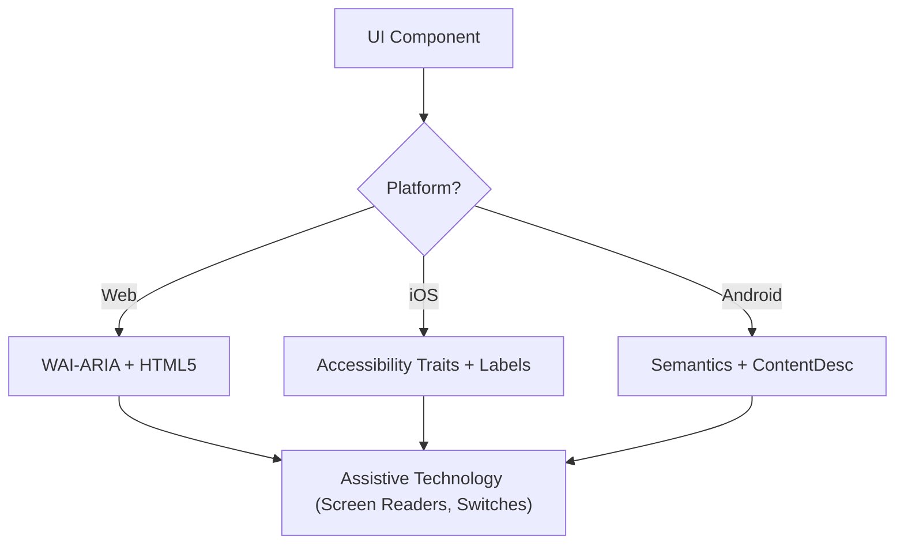

# Acessibilidade (WCAG 2.2)

Esta skill garante que interfaces digitais sejam Perceptíveis, Operáveis, Compreensíveis e Robustas (POUR) para todos os usuários, incluindo aqueles que usam leitores de tela, controles por switch ou navegação por teclado. Ela foca na implementação técnica dos critérios de sucesso da WCAG 2.2.

## When to Use

- Definir especificações de componentes de UI para Web, iOS ou Android.
- Auditar código existente em busca de barreiras de acessibilidade ou lacunas de conformidade.
- Implementar novos padrões da WCAG 2.2 como Target Size (Minimum) e Focus Appearance.
- Mapear requisitos de design de alto nível para atributos técnicos (papéis ARIA, traits, hints).

## Conceitos Centrais

- **Princípios POUR**: A base da WCAG (Perceptível, Operável, Compreensível, Robusto).
- **Mapeamento Semântico**: Usar elementos nativos em vez de contêineres genéricos para fornecer acessibilidade embutida.
- **Árvore de Acessibilidade**: A representação da UI que as tecnologias assistivas de fato "leem".
- **Gerenciamento de Foco**: Controlar a ordem e a visibilidade do cursor de teclado/leitor de tela.
- **Rotulagem e Hints**: Fornecer contexto por meio de `aria-label`, `accessibilityLabel` e `contentDescription`.

## How It Works

### Passo 1: Identificar o Papel do Componente

Determine o propósito funcional (ex.: Isto é um botão, um link ou uma aba?). Use o elemento nativo mais semântico disponível antes de recorrer a papéis customizados.

### Passo 2: Definir Atributos Perceptíveis

- Garanta que o contraste de texto atinja **4.5:1** (normal) ou **3:1** (grande/UI).
- Adicione alternativas de texto para conteúdo não textual (imagens, ícones).
- Implemente reflow responsivo (até 400% de zoom sem perda de função).

### Passo 3: Implementar Controles Operáveis

- Garanta um tamanho de alvo mínimo de **24x24 pixels CSS** (WCAG 2.2 SC 2.5.8).
- Verifique se todos os elementos interativos são alcançáveis via teclado e têm um indicador de foco visível (SC 2.4.11).
- Forneça alternativas de ponteiro único para movimentos de arrastar.

### Passo 4: Garantir Lógica Compreensível

- Use padrões de navegação consistentes.
- Forneça mensagens de erro descritivas e sugestões de correção (SC 3.3.3).
- Implemente "Redundant Entry" (SC 3.3.7) para evitar pedir o mesmo dado duas vezes.

### Passo 5: Verificar Compatibilidade Robusta

- Use padrões corretos de `Name, Role, Value`.
- Implemente `aria-live` ou regiões dinâmicas (live regions) para atualizações de status em tempo real.

## Diagrama de Arquitetura de Acessibilidade



## Mapeamento Multiplataforma

| Recurso            | Web (HTML/ARIA)          | iOS (SwiftUI)                        | Android (Compose)                                           |
| :----------------- | :----------------------- | :----------------------------------- | :---------------------------------------------------------- |
| **Rótulo Primário**  | `aria-label` / `<label>` | `.accessibilityLabel()`              | `contentDescription`                                        |
| **Hint Secundário** | `aria-describedby`       | `.accessibilityHint()`               | `Modifier.semantics { stateDescription = ... }`             |
| **Papel de Ação**    | `role="button"`          | `.accessibilityAddTraits(.isButton)` | `Modifier.semantics { role = Role.Button }`                 |
| **Atualizações em Tempo Real**   | `aria-live="polite"`     | `.accessibilityLiveRegion(.polite)`  | `Modifier.semantics { liveRegion = LiveRegionMode.Polite }` |

## Examples

### Web: Busca Acessível

```html
<form role="search">
  <label for="search-input" class="sr-only">Search products</label>
  <input type="search" id="search-input" placeholder="Search..." />
  <button type="submit" aria-label="Submit Search">
    <svg aria-hidden="true">...</svg>
  </button>
</form>
```

### iOS: Botão de Ação Acessível

```swift
Button(action: deleteItem) {
    Image(systemName: "trash")
}
.accessibilityLabel("Delete item")
.accessibilityHint("Permanently removes this item from your list")
.accessibilityAddTraits(.isButton)
```

### Android: Toggle Acessível

```kotlin
Switch(
    checked = isEnabled,
    onCheckedChange = { onToggle() },
    modifier = Modifier.semantics {
        contentDescription = "Enable notifications"
    }
)
```

## Anti-Padrões a Evitar

- **Div-Buttons**: Usar um `<div>` ou `<span>` para um evento de clique sem adicionar um papel e suporte a teclado.
- **Significado Apenas por Cor**: Indicar um erro ou status _apenas_ com uma mudança de cor (ex.: deixar uma borda vermelha).
- **Foco de Modal Não Contido**: Modais que não retêm o foco, permitindo que usuários de teclado naveguem pelo conteúdo de fundo enquanto o modal está aberto. O foco deve ser contido _e_ escapável via tecla `Escape` ou um botão de fechar explícito (WCAG SC 2.1.2).
- **Alt Text Redundante**: Usar "Image of..." ou "Picture of..." no alt text (leitores de tela já anunciam o papel "Image").

## Checklist de Boas Práticas

- [ ] Elementos interativos atingem o tamanho de alvo de **24x24px** (Web) ou **44x44pt** (Native).
- [ ] Indicadores de foco são claramente visíveis e de alto contraste.
- [ ] Modais **contêm o foco** enquanto abertos e o liberam de forma limpa ao fechar (tecla `Escape` ou botão de fechar).
- [ ] Dropdowns e menus restauram o foco ao elemento de gatilho ao fechar.
- [ ] Formulários fornecem sugestões de erro baseadas em texto.
- [ ] Todos os botões somente de ícone têm um rótulo de texto descritivo.
- [ ] O conteúdo refluído (reflow) corretamente quando o texto é escalonado.

## Referências

- [WCAG 2.2 Guidelines](https://www.w3.org/TR/WCAG22/)
- [WAI-ARIA Authoring Practices](https://www.w3.org/TR/wai-aria-practices/)
- [iOS Accessibility Programming Guide](https://developer.apple.com/documentation/accessibility)
- [iOS Human Interface Guidelines - Accessibility](https://developer.apple.com/design/human-interface-guidelines/accessibility)
- [Android Accessibility Developer Guide](https://developer.android.com/guide/topics/ui/accessibility)

## Skills Relacionadas

- `frontend-patterns`
- `design-system`
- `liquid-glass-design`
- `swiftui-patterns`
