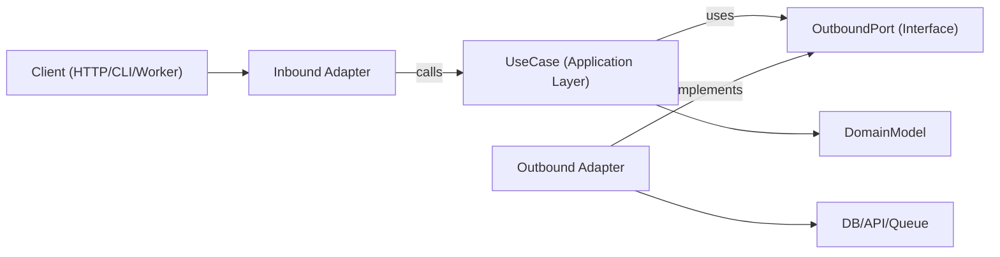

# Arquitetura Hexagonal

A arquitetura hexagonal (Portas e Adaptadores) mantém a lógica de negócio independente de frameworks, transporte e detalhes de persistência. A aplicação central depende de portas abstratas, e adaptadores implementam essas portas nas bordas.

## Quando Usar

- Construindo novas features onde manutenibilidade e testabilidade de longo prazo importam.
- Refatorando código em camadas ou com muito framework onde a lógica de domínio está misturada com preocupações de I/O.
- Suportando múltiplas interfaces para o mesmo caso de uso (HTTP, CLI, workers de fila, cron jobs).
- Substituindo infraestrutura (banco de dados, APIs externas, barramento de mensagens) sem reescrever regras de negócio.

Use esta skill quando a solicitação envolver fronteiras, design centrado em domínio, refatoração de serviços fortemente acoplados ou desacoplamento da lógica de aplicação de bibliotecas específicas.

## Conceitos Fundamentais

- **Modelo de domínio**: Regras de negócio e entidades/objetos de valor. Sem imports de framework.
- **Casos de uso (camada de aplicação)**: Orquestram comportamento de domínio e passos de fluxo de trabalho.
- **Portas de entrada**: Contratos descrevendo o que a aplicação pode fazer (interfaces de comandos/consultas/casos de uso).
- **Portas de saída**: Contratos para dependências que a aplicação precisa (repositórios, gateways, publicadores de eventos, relógio, UUID, etc.).
- **Adaptadores**: Implementações de infraestrutura e entrega de portas (controladores HTTP, repositórios de BD, consumidores de fila, wrappers de SDK).
- **Raiz de composição**: Local único de conexão onde adaptadores concretos são vinculados a casos de uso.

Interfaces de portas de saída geralmente residem na camada de aplicação (ou somente no domínio quando a abstração é verdadeiramente de nível de domínio), enquanto adaptadores de infraestrutura as implementam.

A direção de dependência é sempre para dentro:

- Adaptadores -> aplicação/domínio
- Aplicação -> interfaces de portas (contratos de entrada/saída)
- Domínio -> abstrações somente de domínio (sem dependências de framework ou infraestrutura)
- Domínio -> nada externo

## Como Funciona

### Passo 1: Modelar uma fronteira de caso de uso

Defina um único caso de uso com um DTO de entrada e saída claros. Mantenha detalhes de transporte (Express `req`, GraphQL `context`, wrappers de payload de job) fora desta fronteira.

### Passo 2: Definir portas de saída primeiro

Identifique cada efeito colateral como uma porta:

- persistência (`UserRepositoryPort`)
- chamadas externas (`BillingGatewayPort`)
- transversais (`LoggerPort`, `ClockPort`)

Portas devem modelar capacidades, não tecnologias.

### Passo 3: Implementar o caso de uso com orquestração pura

A classe/função de caso de uso recebe portas via construtor/argumentos. Ela valida invariantes de nível de aplicação, coordena regras de domínio e retorna estruturas de dados simples.

### Passo 4: Construir adaptadores na borda

- Adaptador de entrada converte entrada de protocolo em entrada de caso de uso.
- Adaptador de saída mapeia contratos de aplicação para APIs/ORM/query builders concretos.
- O mapeamento fica nos adaptadores, não dentro dos casos de uso.

### Passo 5: Conectar tudo em uma raiz de composição

Instancie adaptadores, então injete-os nos casos de uso. Mantenha essa conexão centralizada para evitar comportamento oculto de service-locator.

### Passo 6: Testar por fronteira

- Teste unitário de casos de uso com portas falsas.
- Teste de integração de adaptadores com dependências de infraestrutura reais.
- Teste E2E de fluxos voltados ao usuário por meio de adaptadores de entrada.

## Diagrama de Arquitetura



## Organização de Módulos Sugerida

Use organização por feature com fronteiras explícitas:

```text
src/
  features/
    orders/
      domain/
        Order.ts
        OrderPolicy.ts
      application/
        ports/
          inbound/
            CreateOrder.ts
          outbound/
            OrderRepositoryPort.ts
            PaymentGatewayPort.ts
        use-cases/
          CreateOrderUseCase.ts
      adapters/
        inbound/
          http/
            createOrderRoute.ts
        outbound/
          postgres/
            PostgresOrderRepository.ts
          stripe/
            StripePaymentGateway.ts
      composition/
        ordersContainer.ts
```

## Exemplo TypeScript

### Definições de porta

```typescript
export interface OrderRepositoryPort {
  save(order: Order): Promise<void>;
  findById(orderId: string): Promise<Order | null>;
}

export interface PaymentGatewayPort {
  authorize(input: { orderId: string; amountCents: number }): Promise<{ authorizationId: string }>;
}
```

### Caso de uso

```typescript
type CreateOrderInput = {
  orderId: string;
  amountCents: number;
};

type CreateOrderOutput = {
  orderId: string;
  authorizationId: string;
};

export class CreateOrderUseCase {
  constructor(
    private readonly orderRepository: OrderRepositoryPort,
    private readonly paymentGateway: PaymentGatewayPort
  ) {}

  async execute(input: CreateOrderInput): Promise<CreateOrderOutput> {
    const order = Order.create({ id: input.orderId, amountCents: input.amountCents });

    const auth = await this.paymentGateway.authorize({
      orderId: order.id,
      amountCents: order.amountCents,
    });

    // markAuthorized retorna uma nova instância de Order; não muta in place.
    const authorizedOrder = order.markAuthorized(auth.authorizationId);
    await this.orderRepository.save(authorizedOrder);

    return {
      orderId: order.id,
      authorizationId: auth.authorizationId,
    };
  }
}
```

### Adaptador de saída

```typescript
export class PostgresOrderRepository implements OrderRepositoryPort {
  constructor(private readonly db: SqlClient) {}

  async save(order: Order): Promise<void> {
    await this.db.query(
      "insert into orders (id, amount_cents, status, authorization_id) values ($1, $2, $3, $4)",
      [order.id, order.amountCents, order.status, order.authorizationId]
    );
  }

  async findById(orderId: string): Promise<Order | null> {
    const row = await this.db.oneOrNone("select * from orders where id = $1", [orderId]);
    return row ? Order.rehydrate(row) : null;
  }
}
```

### Raiz de composição

```typescript
export const buildCreateOrderUseCase = (deps: { db: SqlClient; stripe: StripeClient }) => {
  const orderRepository = new PostgresOrderRepository(deps.db);
  const paymentGateway = new StripePaymentGateway(deps.stripe);

  return new CreateOrderUseCase(orderRepository, paymentGateway);
};
```

## Mapeamento Multi-Linguagem

Use as mesmas regras de fronteira em diferentes ecossistemas; apenas a sintaxe e o estilo de conexão mudam.

- **TypeScript/JavaScript**
  - Portas: `application/ports/*` como interfaces/tipos.
  - Casos de uso: classes/funções com injeção via construtor/argumento.
  - Adaptadores: `adapters/inbound/*`, `adapters/outbound/*`.
  - Composição: módulo de fábrica/container explícito (sem globais ocultos).
- **Java**
  - Pacotes: `domain`, `application.port.in`, `application.port.out`, `application.usecase`, `adapter.in`, `adapter.out`.
  - Portas: interfaces em `application.port.*`.
  - Casos de uso: classes simples (`@Service` do Spring é opcional, não obrigatório).
  - Composição: classe de configuração Spring ou classe de conexão manual; mantenha a conexão fora das classes de domínio/caso de uso.
- **Kotlin**
  - Módulos/pacotes espelham a divisão Java (`domain`, `application.port`, `application.usecase`, `adapter`).
  - Portas: interfaces Kotlin.
  - Casos de uso: classes com injeção via construtor (Koin/Dagger/Spring/manual).
  - Composição: definições de módulo ou funções de composição dedicadas; evite padrões de service locator.
- **Go**
  - Pacotes: `internal/<feature>/domain`, `application`, `ports`, `adapters/inbound`, `adapters/outbound`.
  - Portas: interfaces pequenas de propriedade do pacote de aplicação consumidor.
  - Casos de uso: structs com campos de interface mais construtores `New...` explícitos.
  - Composição: conecte em `cmd/<app>/main.go` (ou pacote de conexão dedicado), mantenha construtores explícitos.

## Anti-Padrões a Evitar

- Entidades de domínio importando modelos ORM, tipos de framework web ou clientes SDK.
- Casos de uso lendo diretamente de `req`, `res` ou metadados de fila.
- Retornando linhas de banco de dados diretamente de casos de uso sem mapeamento de domínio/aplicação.
- Deixar adaptadores chamar uns aos outros diretamente em vez de fluir por portas de caso de uso.
- Espalhar a conexão de dependências por muitos arquivos com singletons globais ocultos.

## Guia de Migração

1. Escolha uma fatia vertical (único endpoint/job) com dor frequente de mudança.
2. Extraia uma fronteira de caso de uso com tipos explícitos de entrada/saída.
3. Introduza portas de saída em torno de chamadas de infraestrutura existentes.
4. Mova a lógica de orquestração de controladores/serviços para o caso de uso.
5. Mantenha os adaptadores antigos, mas faça-os delegar ao novo caso de uso.
6. Adicione testes em torno da nova fronteira (unidade + integração de adaptador).
7. Repita fatia por fatia; evite reescritas completas.

### Refatorando Sistemas Existentes

- **Abordagem Strangler**: mantenha os endpoints atuais, roteie um caso de uso por vez por novas portas/adaptadores.
- **Sem reescritas big-bang**: migre por fatia de feature e preserve o comportamento com testes de caracterização.
- **Facade primeiro**: envolva serviços legados atrás de portas de saída antes de substituir os internos.
- **Congelamento de composição**: centralize a conexão cedo para que novas dependências não vazem para as camadas de domínio/caso de uso.
- **Regra de seleção de fatia**: priorize fluxos de alta rotatividade e baixo raio de explosão primeiro.
- **Caminho de rollback**: mantenha um toggle reversível ou chave de rota por fatia migrada até que o comportamento em produção seja verificado.

## Orientação de Testes (Mesmas Fronteiras Hexagonais)

- **Testes de domínio**: teste entidades/objetos de valor como regras de negócio puras (sem mocks, sem configuração de framework).
- **Testes unitários de caso de uso**: teste orquestração com fakes/Stubs para portas de saída; afirme resultados de negócio e interações de porta.
- **Testes de contrato de adaptador de saída**: defina suítes de contrato compartilhadas no nível de porta e execute-as em cada implementação de adaptador.
- **Testes de adaptador de entrada**: verifique o mapeamento de protocolo (HTTP/CLI/payload de fila para entrada de caso de uso e mapeamento de saída/erro de volta ao protocolo).
- **Testes de integração de adaptador**: execute contra infraestrutura real (BD/API/fila) para serialização, comportamento de esquema/consulta, retries e timeouts.
- **Testes de ponta a ponta**: cubra jornadas críticas do usuário por adaptador de entrada -> caso de uso -> adaptador de saída.
- **Segurança de refatoração**: adicione testes de caracterização antes da extração; mantenha-os até que o comportamento da nova fronteira seja estável e equivalente.

## Lista de Verificação de Melhores Práticas

- As camadas de domínio e caso de uso importam apenas tipos internos e portas.
- Toda dependência externa é representada por uma porta de saída.
- A validação ocorre nas fronteiras (adaptador de entrada + invariantes de caso de uso).
- Use transformações imutáveis (retorne novos valores/entidades em vez de mutar estado compartilhado).
- Erros são traduzidos entre fronteiras (erros de infraestrutura -> erros de aplicação/domínio).
- A raiz de composição é explícita e fácil de auditar.
- Casos de uso são testáveis com fakes simples em memória para portas.
- A refatoração começa de uma fatia vertical com testes de preservação de comportamento.
- Especificidades de linguagem/framework ficam nos adaptadores, nunca nas regras de domínio.
