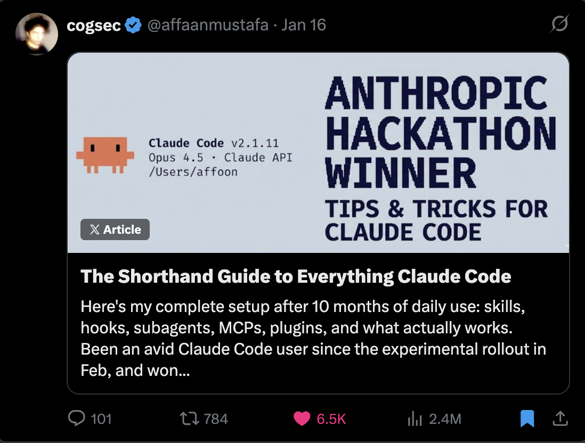
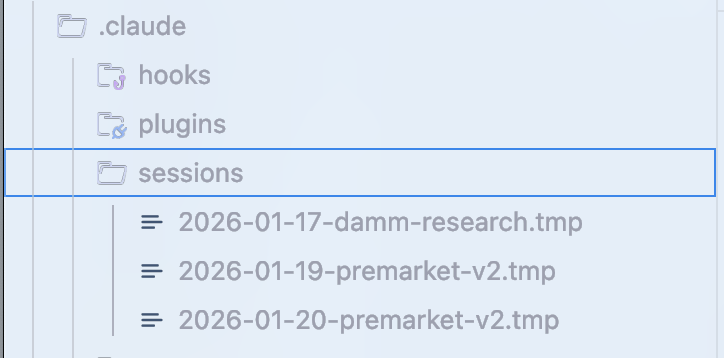
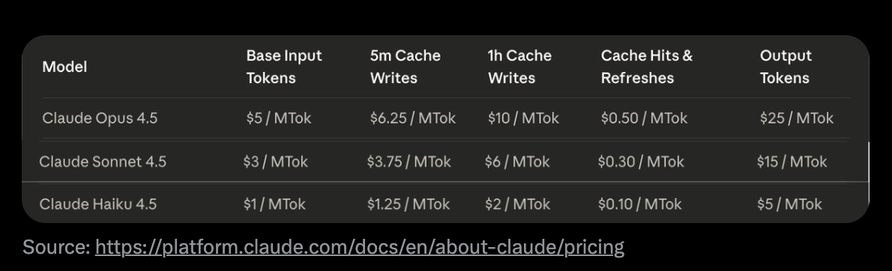
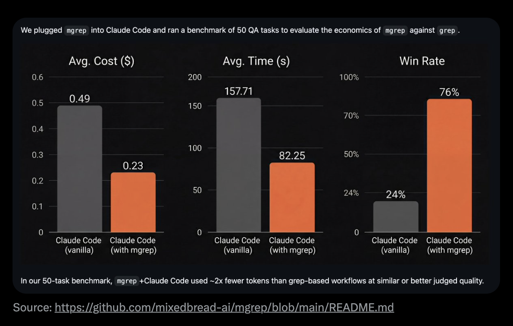
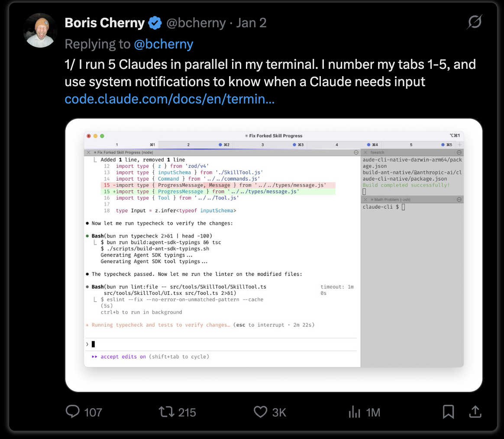
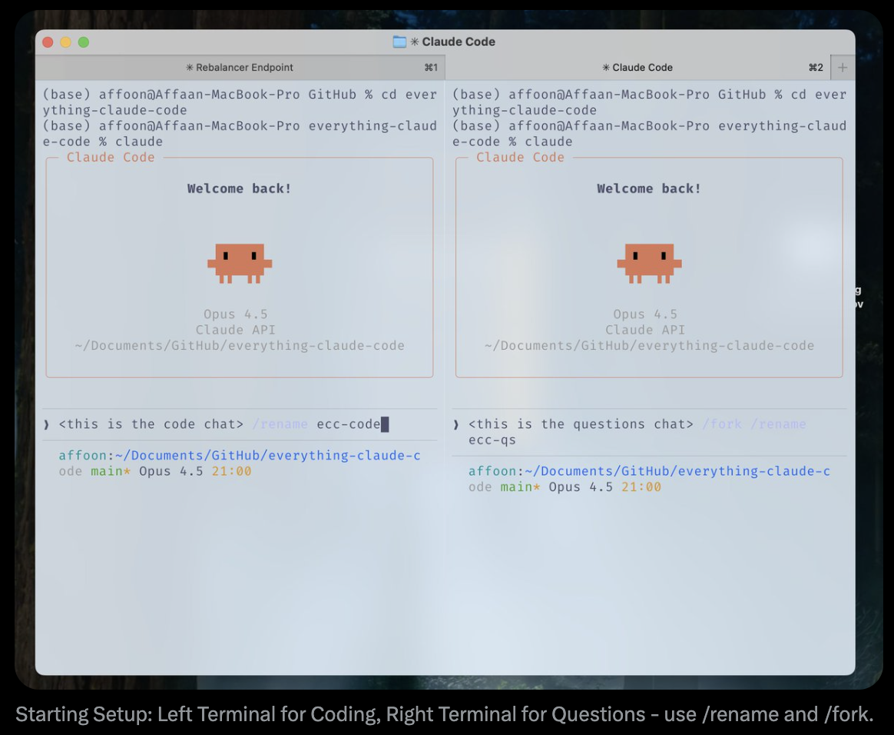
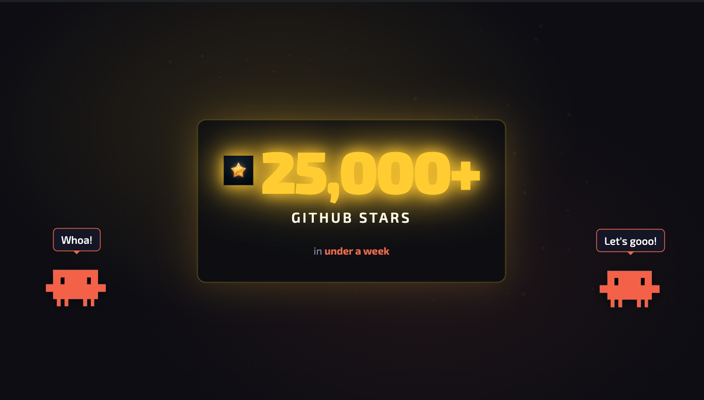

# O Guia Detalhado para o Everything Claude Code


---

> **Pré-requisito**: Este guia se baseia em [O Guia Resumido para o Everything Claude Code](./the-shortform-guide.md). Leia-o primeiro caso ainda não tenha configurado Skills, Hooks, subagentes, MCPs e Plugins.


*O Guia Resumido - leia-o primeiro*

No guia resumido, abordei a configuração fundamental: Skills e comandos, Hooks, subagentes, MCPs, Plugins e os padrões de configuração que formam a espinha dorsal de um fluxo de trabalho eficaz com o Claude Code. Aquele era o guia de configuração e a infraestrutura base.

Este guia detalhado mergulha nas técnicas que separam sessões produtivas das que desperdiçam recursos. Se você ainda não leu o guia resumido, volte e configure suas configs primeiro. O que segue assume que você já tem Skills, agentes, Hooks e MCPs configurados e funcionando.

Os temas aqui: economia de Tokens, persistência de memória, padrões de verificação, estratégias de paralelização e os efeitos compostos de construir fluxos de trabalho reutilizáveis. Esses são os padrões que refinei ao longo de mais de 10 meses de uso diário e que fazem a diferença entre ser atormentado pela degradação de contexto na primeira hora e manter sessões produtivas por horas.

Tudo o que é abordado nos guias resumido e detalhado está disponível no GitHub: `github.com/affaan-m/everything-claude-code`

---

## Dicas e Truques

### Alguns MCPs São Substituíveis e Vão Liberar Sua Janela de Contexto

Para MCPs como controle de versão (GitHub), bancos de dados (Supabase), deploy (Vercel, Railway), etc. - a maioria dessas plataformas já tem CLIs robustas que o MCP basicamente apenas envolve. O MCP é um wrapper agradável, mas vem com um custo.

Para fazer a CLI funcionar mais como um MCP sem de fato usar o MCP (e a janela de contexto reduzida que vem com ele), considere agrupar a funcionalidade em Skills e comandos. Extraia as ferramentas que o MCP expõe e que facilitam as coisas e transforme-as em comandos.

Exemplo: em vez de ter o MCP do GitHub carregado o tempo todo, crie um comando `/gh-pr` que envolva `gh pr create` com suas opções preferidas. Em vez de o MCP do Supabase consumir contexto, crie Skills que usem a CLI do Supabase diretamente.

Com lazy loading, o problema da janela de contexto está em grande parte resolvido. Mas o uso de Tokens e o custo não são resolvidos da mesma forma. A abordagem CLI + Skills ainda é um método de otimização de Tokens.

---

## COISAS IMPORTANTES

### Gerenciamento de Contexto e Memória

Para compartilhar memória entre sessões, a melhor aposta é uma Skill ou comando que resuma e faça um balanço do progresso, então salve em um arquivo `.tmp` na sua pasta `.claude` e vá adicionando a ele até o fim da sua sessão. No dia seguinte, ele pode usar isso como contexto e retomar de onde você parou; crie um arquivo novo para cada sessão para não poluir o novo trabalho com contexto antigo.


*Exemplo de armazenamento de sessão -> <https://github.com/affaan-m/everything-claude-code/tree/main/examples/sessions>*

O Claude cria um arquivo resumindo o estado atual. Revise-o, peça edições se necessário, e então comece do zero. Para a nova conversa, basta fornecer o caminho do arquivo. Particularmente útil quando você está atingindo os limites de contexto e precisa dar continuidade a um trabalho complexo. Esses arquivos devem conter:
- Quais abordagens funcionaram (de forma verificável, com evidências)
- Quais abordagens foram tentadas, mas não funcionaram
- Quais abordagens não foram tentadas e o que falta fazer

**Limpando o Contexto Estrategicamente:**

Depois que você tem seu plano definido e o contexto limpo (opção padrão no modo de planejamento do Claude Code agora), você pode trabalhar a partir do plano. Isso é útil quando você acumulou muito contexto de exploração que já não é relevante para a execução. Para uma compactação estratégica, desative a compactação automática. Compacte manualmente em intervalos lógicos ou crie uma Skill que faça isso por você.

**Avançado: Injeção Dinâmica de System Prompt**

Um padrão que aprendi: em vez de colocar tudo apenas no CLAUDE.md (escopo de usuário) ou em `.claude/rules/` (escopo de projeto), que carregam em toda sessão, use flags da CLI para injetar contexto dinamicamente.

```bash
claude --system-prompt "$(cat memory.md)"
```

Isso permite que você seja mais cirúrgico sobre qual contexto carrega e quando. O conteúdo do system prompt tem autoridade maior que as mensagens do usuário, que têm autoridade maior que os resultados de ferramentas.

**Configuração prática:**

```bash
# Daily development
alias claude-dev='claude --system-prompt "$(cat ~/.claude/contexts/dev.md)"'

# PR review mode
alias claude-review='claude --system-prompt "$(cat ~/.claude/contexts/review.md)"'

# Research/exploration mode
alias claude-research='claude --system-prompt "$(cat ~/.claude/contexts/research.md)"'
```

**Avançado: Hooks de Persistência de Memória**

Existem Hooks que a maioria das pessoas não conhece e que ajudam com a memória:

- **Hook PreCompact**: Antes de a compactação de contexto acontecer, salva o estado importante em um arquivo
- **Hook Stop (Fim de Sessão)**: No fim da sessão, persiste os aprendizados em um arquivo
- **Hook SessionStart**: Em uma nova sessão, carrega o contexto anterior automaticamente

Eu construí esses Hooks e eles estão no repositório em `github.com/affaan-m/everything-claude-code/tree/main/hooks/memory-persistence`

---

### Aprendizado Contínuo / Memória

Se você teve que repetir um prompt várias vezes e o Claude esbarrou no mesmo problema ou deu uma resposta que você já tinha ouvido antes - esses padrões precisam ser adicionados às Skills.

**O Problema:** Tokens desperdiçados, contexto desperdiçado, tempo desperdiçado.

**A Solução:** Quando o Claude Code descobre algo que não é trivial - uma técnica de depuração, um contorno, algum padrão específico do projeto - ele salva esse conhecimento como uma nova Skill. Na próxima vez que um problema semelhante surgir, a Skill é carregada automaticamente.

Eu construí uma Skill de aprendizado contínuo que faz isso: `github.com/affaan-m/everything-claude-code/tree/main/skills/continuous-learning`

**Por que o Hook Stop (e não o UserPromptSubmit):**

A decisão-chave de design é usar um **Hook Stop** em vez do UserPromptSubmit. O UserPromptSubmit roda a cada mensagem - adiciona latência a cada prompt. O Stop roda uma vez no fim da sessão - leve, não te atrasa durante a sessão.

---

### Otimização de Tokens

**Estratégia Principal: Arquitetura de Subagentes**

Otimize as ferramentas que você usa e uma arquitetura de subagentes projetada para delegar ao modelo mais barato possível que seja suficiente para a tarefa.

**Referência Rápida de Seleção de Modelo:**


*Configuração hipotética de subagentes em várias tarefas comuns e o raciocínio por trás das escolhas*

| Tipo de Tarefa            | Modelo | Por quê                                          |
| ------------------------- | ------ | ------------------------------------------------ |
| Exploração/busca          | Haiku  | Rápido, barato, bom o suficiente para achar arquivos |
| Edições simples           | Haiku  | Mudanças em arquivo único, instruções claras     |
| Implementação multi-arquivo | Sonnet | Melhor equilíbrio para programação             |
| Arquitetura complexa      | Opus   | Necessita de raciocínio profundo                 |
| Revisões de PR            | Sonnet | Entende o contexto, capta nuances                |
| Análise de segurança      | Opus   | Não pode se dar ao luxo de perder vulnerabilidades |
| Escrever docs             | Haiku  | A estrutura é simples                            |
| Depurar bugs complexos    | Opus   | Precisa manter o sistema inteiro em mente        |

Use o Sonnet por padrão em 90% das tarefas de programação. Faça upgrade para o Opus quando a primeira tentativa falhou, a tarefa abrange 5+ arquivos, decisões arquiteturais ou código crítico para segurança.

**Referência de Preços:**


*Fonte: <https://platform.claude.com/docs/en/about-claude/pricing>*

**Otimizações Específicas de Ferramentas:**

Substitua o grep pelo mgrep - ~50% de redução de Tokens em média comparado ao grep tradicional ou ao ripgrep:


*No nosso benchmark de 50 tarefas, o mgrep + Claude Code usou ~2x menos Tokens que fluxos de trabalho baseados em grep, com qualidade avaliada similar ou melhor. Fonte: mgrep por @mixedbread-ai*

**Benefícios de uma Base de Código Modular:**

Ter uma base de código mais modular, com arquivos principais na casa das centenas de linhas em vez de milhares de linhas, ajuda tanto nos custos de otimização de Tokens quanto em concluir uma tarefa corretamente na primeira tentativa.

---

### Loops de Verificação e Evals

**Fluxo de Trabalho de Benchmarking:**

Compare pedir a mesma coisa com e sem uma Skill e verifique a diferença na saída:

Bifurque a conversa, inicie um novo worktree em uma delas sem a Skill, abra um diff no final, veja o que foi registrado.

**Tipos de Padrões de Eval:**

- **Evals Baseados em Checkpoint**: Defina checkpoints explícitos, verifique contra critérios definidos, corrija antes de prosseguir
- **Evals Contínuos**: Execute a cada N minutos ou após grandes mudanças, suíte de testes completa + lint

**Métricas-Chave:**

```
pass@k: At least ONE of k attempts succeeds
        k=1: 70%  k=3: 91%  k=5: 97%

pass^k: ALL k attempts must succeed
        k=1: 70%  k=3: 34%  k=5: 17%
```

Use **pass@k** quando você só precisa que funcione. Use **pass^k** quando a consistência é essencial.

---

## PARALELIZAÇÃO

Ao bifurcar conversas em uma configuração de terminal multi-Claude, garanta que o escopo esteja bem definido para as ações na bifurcação e na conversa original. Busque a mínima sobreposição quando se trata de mudanças de código.

**Meu Padrão Preferido:**

Chat principal para mudanças de código, bifurcações para perguntas sobre a base de código e seu estado atual, ou pesquisa sobre serviços externos.

**Sobre Quantidades Arbitrárias de Terminais:**


*Boris (Anthropic) sobre rodar múltiplas instâncias do Claude*

O Boris tem dicas sobre paralelização. Ele sugeriu coisas como rodar 5 instâncias do Claude localmente e 5 na origem. Eu desaconselho definir quantidades arbitrárias de terminais. A adição de um terminal deve partir de uma verdadeira necessidade.

Seu objetivo deve ser: **o quanto você consegue realizar com a quantidade mínima viável de paralelização.**

**Git Worktrees para Instâncias Paralelas:**

```bash
# Create worktrees for parallel work
git worktree add ../project-feature-a feature-a
git worktree add ../project-feature-b feature-b
git worktree add ../project-refactor refactor-branch

# Each worktree gets its own Claude instance
cd ../project-feature-a && claude
```

SE você for começar a escalar suas instâncias E tiver múltiplas instâncias do Claude trabalhando em código que se sobrepõe, é imperativo que você use git worktrees e tenha um plano muito bem definido para cada uma. Use `/rename <name here>` para nomear todos os seus chats.


*Configuração Inicial: Terminal Esquerdo para Programação, Terminal Direito para Perguntas - use /rename e /fork*

**O Método Cascade:**

Ao rodar múltiplas instâncias do Claude Code, organize com um padrão "cascade":

- Abra novas tarefas em novas abas à direita
- Varra da esquerda para a direita, da mais antiga para a mais nova
- Foque em no máximo 3-4 tarefas por vez

---

## TRABALHO DE BASE

**O Padrão de Início com Duas Instâncias:**

Para o gerenciamento do meu próprio fluxo de trabalho, gosto de começar um repositório vazio com 2 instâncias do Claude abertas.

**Instância 1: Agente de Scaffolding**
- Estabelece o scaffold e o trabalho de base
- Cria a estrutura do projeto
- Configura as configs (CLAUDE.md, regras, agentes)

**Instância 2: Agente de Deep Research**
- Conecta a todos os seus serviços, busca na web
- Cria o PRD detalhado
- Cria diagramas de arquitetura em mermaid
- Compila as referências com trechos reais de documentação

**Padrão llms.txt:**

Se disponível, você pode encontrar um `llms.txt` em muitas referências de documentação acrescentando `/llms.txt` a elas assim que chegar à página de docs. Isso te dá uma versão limpa e otimizada para LLM da documentação.

**Filosofia: Construa Padrões Reutilizáveis**

De @omarsar0: "No começo, dediquei tempo a construir fluxos de trabalho/padrões reutilizáveis. Tedioso de construir, mas isso teve um efeito composto absurdo conforme os modelos e os harnesses de agentes melhoravam."

**No que investir:**

- Subagentes
- Skills
- Comandos
- Padrões de planejamento
- Ferramentas MCP
- Padrões de engenharia de contexto

---

## Boas Práticas para Agentes e Subagentes

**O Problema de Contexto do Subagente:**

Subagentes existem para economizar contexto retornando resumos em vez de despejar tudo. Mas o orquestrador tem contexto semântico que o subagente não tem. O subagente só conhece a consulta literal, não o PROPÓSITO por trás da solicitação.

**Padrão de Recuperação Iterativa:**

1. O orquestrador avalia cada retorno do subagente
2. Faça perguntas de acompanhamento antes de aceitá-lo
3. O subagente volta à fonte, obtém respostas, retorna
4. Repita o loop até ser suficiente (máx. 3 ciclos)

**Chave:** Passe o contexto do objetivo, não apenas a consulta.

**Orquestrador com Fases Sequenciais:**

```markdown
Phase 1: RESEARCH (use Explore agent) → research-summary.md
Phase 2: PLAN (use planner agent) → plan.md
Phase 3: IMPLEMENT (use tdd-guide agent) → code changes
Phase 4: REVIEW (use code-reviewer agent) → review-comments.md
Phase 5: VERIFY (use build-error-resolver if needed) → done or loop back
```

**Regras-chave:**

1. Cada agente recebe UMA entrada clara e produz UMA saída clara
2. As saídas se tornam entradas para a fase seguinte
3. Nunca pule fases
4. Use `/clear` entre os agentes
5. Armazene as saídas intermediárias em arquivos

---

## COISAS DIVERTIDAS / NÃO CRÍTICAS, APENAS DICAS DIVERTIDAS

### Status Line Personalizada

Você pode configurá-la usando `/statusline` - então o Claude vai dizer que você não tem uma, mas que pode configurá-la para você e perguntar o que você quer nela.

Veja também: ccstatusline (projeto da comunidade para status lines personalizadas do Claude Code)

### Transcrição por Voz

Fale com o Claude Code usando sua voz. Mais rápido que digitar para muitas pessoas.

- superwhisper, MacWhisper no Mac
- Mesmo com erros de transcrição, o Claude entende a intenção

### Aliases de Terminal

```bash
alias c='claude'
alias gb='github'
alias co='code'
alias q='cd ~/Desktop/projects'
```

---

## Marco


*Mais de 25.000 estrelas no GitHub em menos de uma semana*

---

## Recursos

**Orquestração de Agentes:**

- claude-flow — Plataforma de orquestração empresarial construída pela comunidade com mais de 54 agentes especializados

**Memória Autoaperfeiçoável:**

- Veja `skills/continuous-learning/` neste repositório
- rlancemartin.github.io/2025/12/01/claude_diary/ - Padrão de reflexão de sessão

**Referência de System Prompts:**

- system-prompts-and-models-of-ai-tools — Coleção da comunidade de system prompts de IA (mais de 110k estrelas)

**Oficial:**

- Anthropic Academy: anthropic.skilljar.com

---

## Referências

- [Anthropic: Demystifying evals for AI agents](https://www.anthropic.com/engineering/demystifying-evals-for-ai-agents)
- [YK: 32 Claude Code Tips](https://agenticcoding.substack.com/p/32-claude-code-tips-from-basics-to)
- [RLanceMartin: Session Reflection Pattern](https://rlancemartin.github.io/2025/12/01/claude_diary/)
- @PerceptualPeak: Sub-Agent Context Negotiation
- @menhguin: Agent Abstractions Tierlist
- @omarsar0: Compound Effects Philosophy

---

*Tudo o que é abordado em ambos os guias está disponível no GitHub em [everything-claude-code](https://github.com/affaan-m/everything-claude-code)*
