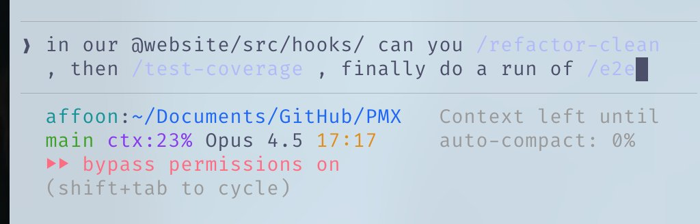
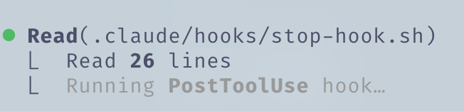
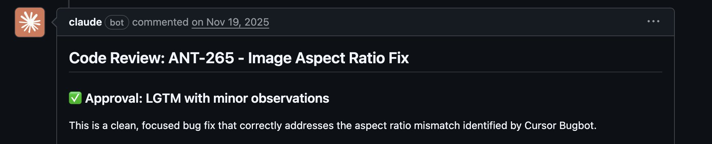
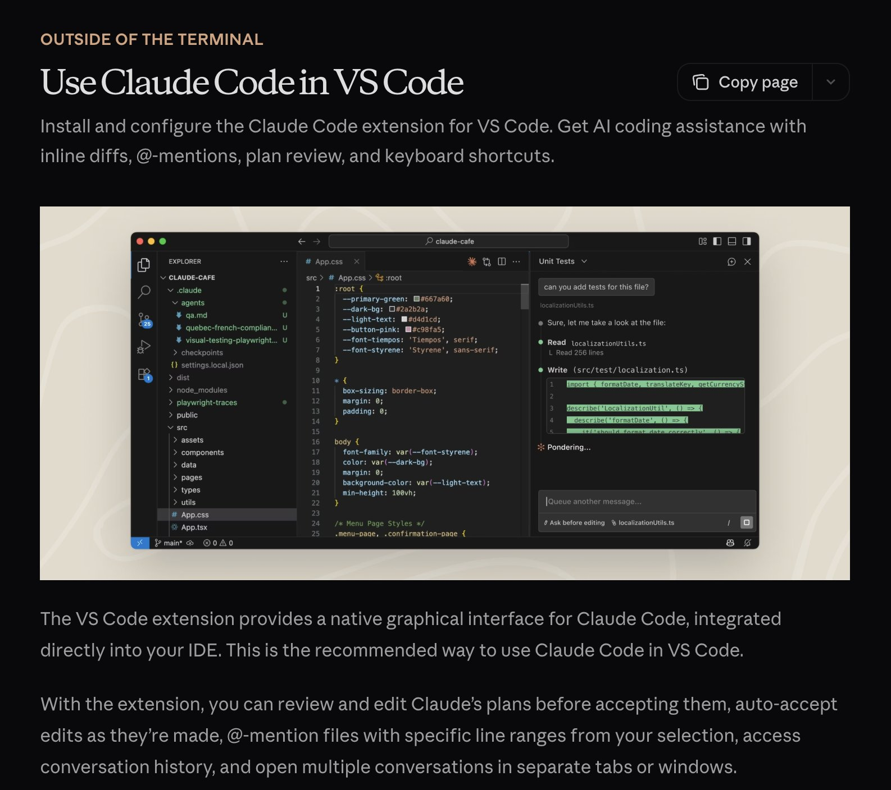
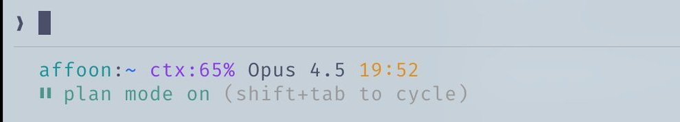

# O Guia Resumido para o Everything Claude Code


---

**Sou um usuário assíduo do Claude Code desde o lançamento experimental em fevereiro, e venci o hackathon Anthropic x Forum Ventures com o [zenith.chat](https://zenith.chat) ao lado de [@DRodriguezFX](https://x.com/DRodriguezFX) - usando inteiramente o Claude Code.**

Aqui está minha configuração completa após 10 meses de uso diário: Skills, Hooks, subagentes, MCPs, Plugins, e o que realmente funciona.

---

## Skills e Comandos

Skills são a principal superfície de fluxo de trabalho. Elas funcionam como pacotes de fluxo de trabalho com escopo definido: prompts reutilizáveis, estrutura, arquivos de apoio e codemaps quando você precisa de um padrão de execução específico.

Depois de uma longa sessão de programação com o Opus 4.5, você quer limpar código morto e arquivos .md soltos? Execute `/refactor-clean`. Precisa de testes? `/tdd`, `/e2e`, `/test-coverage`. Esses atalhos de barra são convenientes, mas a unidade realmente duradoura é a Skill subjacente. As Skills também podem incluir codemaps - uma forma de o Claude navegar rapidamente pela sua base de código sem gastar contexto com exploração.


*Encadeando comandos em sequência*

O ECC ainda inclui uma camada `commands/`, mas o melhor é pensá-la como compatibilidade legada de atalhos de barra durante a migração. A lógica duradoura deve viver nas Skills.

- **Skills**: `~/.claude/skills/` - definições canônicas de fluxo de trabalho
- **Comandos**: `~/.claude/commands/` - shims legados de atalho de barra para quando você ainda precisa deles

```bash
# Example skill structure
~/.claude/skills/
  pmx-guidelines.md      # Project-specific patterns
  coding-standards.md    # Language best practices
  tdd-workflow/          # Multi-file skill with SKILL.md
  security-review/       # Checklist-based skill
```

---

## Hooks

Hooks são automações baseadas em gatilhos que disparam em eventos específicos. Diferentemente das Skills, eles ficam restritos a chamadas de ferramentas e eventos de ciclo de vida.

**Tipos de Hook:**

1. **PreToolUse** - Antes de uma ferramenta executar (validação, lembretes)
2. **PostToolUse** - Depois de uma ferramenta terminar (formatação, loops de feedback)
3. **UserPromptSubmit** - Quando você envia uma mensagem
4. **Stop** - Quando o Claude termina de responder
5. **PreCompact** - Antes da compactação de contexto
6. **Notification** - Solicitações de permissão

**Exemplo: lembrete de tmux antes de comandos de longa duração**

```json
{
  "PreToolUse": [
    {
      "matcher": "tool == \"Bash\" && tool_input.command matches \"(npm|pnpm|yarn|cargo|pytest)\"",
      "hooks": [
        {
          "type": "command",
          "command": "if [ -z \"$TMUX\" ]; then echo '[Hook] Consider tmux for session persistence' >&2; fi"
        }
      ]
    }
  ]
}
```


*Exemplo do feedback que você recebe no Claude Code ao executar um Hook PostToolUse*

**Dica profissional:** Use o Plugin `hookify` para criar Hooks de forma conversacional em vez de escrever JSON manualmente. Execute `/hookify` e descreva o que você quer.

---

## Subagentes

Subagentes são processos para os quais seu orquestrador (o Claude principal) pode delegar tarefas com escopos limitados. Eles podem rodar em segundo plano ou em primeiro plano, liberando contexto para o agente principal.

Subagentes funcionam muito bem com Skills - um subagente capaz de executar um subconjunto das suas Skills pode receber tarefas delegadas e usar essas Skills de forma autônoma. Eles também podem ser isolados em sandbox com permissões de ferramentas específicas.

```bash
# Example subagent structure
~/.claude/agents/
  planner.md           # Feature implementation planning
  architect.md         # System design decisions
  tdd-guide.md         # Test-driven development
  code-reviewer.md     # Quality/security review
  security-reviewer.md # Vulnerability analysis
  build-error-resolver.md
  e2e-runner.md
  refactor-cleaner.md
```

Configure as ferramentas permitidas, MCPs e permissões por subagente para um escopo adequado.

---

## Regras e Memória

Sua pasta `.rules` contém arquivos `.md` com boas práticas que o Claude deve SEMPRE seguir. Duas abordagens:

1. **CLAUDE.md único** - Tudo em um arquivo (nível de usuário ou de projeto)
2. **Pasta de regras** - Arquivos `.md` modulares agrupados por área de interesse

```bash
~/.claude/rules/
  security.md      # No hardcoded secrets, validate inputs
  coding-style.md  # Immutability, file organization
  testing.md       # TDD workflow, 80% coverage
  git-workflow.md  # Commit format, PR process
  agents.md        # When to delegate to subagents
  performance.md   # Model selection, context management
```

**Exemplos de regras:**

- Nada de emojis na base de código
- Evitar tons de roxo no frontend
- Sempre testar o código antes do deploy
- Priorizar código modular em vez de arquivos gigantes
- Nunca commitar console.logs

---

## MCPs (Model Context Protocol)

MCPs conectam o Claude a serviços externos diretamente. Não são um substituto para APIs - são um wrapper orientado por prompt em torno delas, permitindo mais flexibilidade na navegação das informações.

**Exemplo:** o MCP do Supabase permite que o Claude extraia dados específicos e execute SQL diretamente na origem, sem copiar e colar. O mesmo vale para bancos de dados, plataformas de deploy, etc.


*Exemplo do MCP do Supabase listando as tabelas dentro do schema public*

**Chrome no Claude:** é um MCP de Plugin embutido que permite ao Claude controlar seu navegador de forma autônoma - clicando por aí para ver como as coisas funcionam.

**CRÍTICO: Gerenciamento da Janela de Contexto**

Seja seletivo com os MCPs. Eu mantenho todos os MCPs na configuração de usuário, mas **desativo tudo o que não uso**. Vá até `/plugins` e role para baixo, ou execute `/mcp`.


*Usando /plugins para navegar até os MCPs e ver quais estão instalados no momento e seu status*

Sua janela de contexto de 200k antes da compactação pode acabar sendo de apenas 70k com ferramentas demais habilitadas. O desempenho cai significativamente.

**Regra geral:** Tenha de 20 a 30 MCPs na configuração, mas mantenha menos de 10 habilitados / menos de 80 ferramentas ativas.

```bash
# Check enabled MCPs
/mcp

# Disable unused ones in ~/.claude/settings.json or in the current repo's .mcp.json
```

---

## Plugins

Plugins empacotam ferramentas para instalação fácil, em vez de uma configuração manual tediosa. Um Plugin pode ser uma Skill + MCP combinados, ou Hooks/ferramentas agrupados.

**Instalando Plugins:**

```bash
# Add a marketplace
# mgrep plugin by @mixedbread-ai
claude plugin marketplace add https://github.com/mixedbread-ai/mgrep

# Open Claude, run /plugins, find new marketplace, install from there
```


*Exibindo o marketplace Mixedbread-Grep recém-instalado*

**Plugins de LSP** são particularmente úteis se você executa o Claude Code fora de editores com frequência. O Language Server Protocol (LSP) dá ao Claude verificação de tipos em tempo real, ir-para-definição e autocompletes inteligentes sem precisar de uma IDE aberta.

```bash
# Enabled plugins example
typescript-lsp@claude-plugins-official  # TypeScript intelligence
pyright-lsp@claude-plugins-official     # Python type checking
hookify@claude-plugins-official         # Create hooks conversationally
mgrep@Mixedbread-Grep                   # Better search than ripgrep
```

O mesmo aviso vale para os MCPs - fique de olho na sua janela de contexto.

---

## Dicas e Truques

### Atalhos de Teclado

- `Ctrl+U` - Apaga a linha inteira (mais rápido que ficar martelando o backspace)
- `!` - Prefixo rápido para comando bash
- `@` - Busca por arquivos
- `/` - Inicia comandos de barra
- `Shift+Enter` - Entrada multilinha
- `Tab` - Alterna a exibição do raciocínio
- `Esc Esc` - Interrompe o Claude / restaura o código

### Fluxos de Trabalho Paralelos

- **Fork** (`/fork`) - Bifurca conversas para fazer tarefas não sobrepostas em paralelo, em vez de encher a fila de mensagens
- **Git Worktrees** - Para Claudes paralelos sobrepostos sem conflitos. Cada worktree é um checkout independente

```bash
git worktree add ../feature-branch feature-branch
# Now run separate Claude instances in each worktree
```

### tmux para Comandos de Longa Duração

Transmita e acompanhe logs/processos bash que o Claude executa:

[Assista: sessão tmux transmitindo um comando de longa duração (vídeo)](./assets/images/shortform/07-tmux-video.mp4)

```bash
tmux new -s dev
# Claude runs commands here, you can detach and reattach
tmux attach -t dev
```

### mgrep > grep

O `mgrep` é uma melhoria significativa em relação ao ripgrep/grep. Instale via marketplace de Plugins e depois use a Skill `/mgrep`. Funciona tanto com busca local quanto com busca na web.

```bash
mgrep "function handleSubmit"  # Local search
mgrep --web "Next.js 15 app router changes"  # Web search
```

### Outros Comandos Úteis

- `/rewind` - Volta a um estado anterior
- `/statusline` - Personalize com Branch, % de contexto, todos
- `/checkpoints` - Pontos de desfazer a nível de arquivo
- `/compact` - Dispara manualmente a compactação de contexto

### CI/CD com GitHub Actions

Configure a revisão de código nos seus PRs com GitHub Actions. O Claude pode revisar PRs automaticamente quando configurado.


*Claude aprovando um PR de correção de bug*

### Sandboxing

Use o modo sandbox para operações arriscadas - o Claude roda em um ambiente restrito sem afetar seu sistema real.

---

## Sobre Editores

A escolha do seu editor impacta significativamente o fluxo de trabalho do Claude Code. Embora o Claude Code funcione a partir de qualquer terminal, combiná-lo com um editor capaz desbloqueia rastreamento de arquivos em tempo real, navegação rápida e execução integrada de comandos.

### Zed (Minha Preferência)

Eu uso o [Zed](https://zed.dev) - escrito em Rust, então é genuinamente rápido. Abre instantaneamente, lida com bases de código enormes sem suar a camisa e mal toca nos recursos do sistema.

**Por que Zed + Claude Code é uma ótima combinação:**

- **Velocidade** - O desempenho baseado em Rust significa nenhum travamento quando o Claude está editando arquivos rapidamente. Seu editor acompanha o ritmo
- **Integração com o Agent Panel** - A integração do Zed com o Claude permite acompanhar mudanças de arquivos em tempo real conforme o Claude edita. Salte entre os arquivos que o Claude referencia sem sair do editor
- **Paleta de Comandos CMD+Shift+R** - Acesso rápido a todos os seus comandos de barra personalizados, depuradores e scripts de build em uma interface pesquisável
- **Uso Mínimo de Recursos** - Não compete com o Claude por RAM/CPU durante operações pesadas. Importante ao rodar o Opus
- **Modo Vim** - Atalhos de teclado completos do vim, se isso for a sua praia


*Editor Zed com o menu de comandos personalizados usando CMD+Shift+R. O modo de acompanhamento aparece como o alvo no canto inferior direito.*

**Dicas Independentes de Editor:**

1. **Divida sua tela** - Terminal com o Claude Code de um lado, editor do outro
2. **Ctrl + G** - abre rapidamente no Zed o arquivo em que o Claude está trabalhando no momento
3. **Auto-save** - Habilite o salvamento automático para que as leituras de arquivos do Claude estejam sempre atualizadas
4. **Integração com Git** - Use os recursos de git do editor para revisar as mudanças do Claude antes de commitar
5. **File watchers** - A maioria dos editores recarrega automaticamente arquivos alterados; verifique se isso está habilitado

### VSCode / Cursor

Esta também é uma escolha viável e funciona bem com o Claude Code. Você pode usá-lo no formato de terminal, com sincronização automática com seu editor usando `\ide`, habilitando a funcionalidade de LSP (de certa forma redundante com os Plugins hoje em dia). Ou você pode optar pela extensão, que é mais integrada ao editor e tem uma UI compatível.


*A extensão do VS Code oferece uma interface gráfica nativa para o Claude Code, integrada diretamente à sua IDE.*

---

## Minha Configuração

### Plugins

**Instalados:** (normalmente só tenho 4-5 deles habilitados por vez)

```markdown
ralph-wiggum@claude-code-plugins       # Loop automation
frontend-patterns@claude-code-plugins  # UI/UX patterns
commit-commands@claude-code-plugins    # Git workflow
security-guidance@claude-code-plugins  # Security checks
pr-review-toolkit@claude-code-plugins  # PR automation
typescript-lsp@claude-plugins-official # TS intelligence
hookify@claude-plugins-official        # Hook creation
code-simplifier@claude-plugins-official
feature-dev@claude-code-plugins
explanatory-output-style@claude-code-plugins
code-review@claude-code-plugins
context7@claude-plugins-official       # Live documentation
pyright-lsp@claude-plugins-official    # Python types
mgrep@Mixedbread-Grep                  # Better search
```

### Servidores MCP

**Configurados (Nível de Usuário):**

```json
{
  "github": { "command": "npx", "args": ["-y", "@modelcontextprotocol/server-github"] },
  "firecrawl": { "command": "npx", "args": ["-y", "firecrawl-mcp"] },
  "supabase": {
    "command": "npx",
    "args": ["-y", "@supabase/mcp-server-supabase@latest", "--project-ref=YOUR_REF"]
  },
  "memory": { "command": "npx", "args": ["-y", "@modelcontextprotocol/server-memory"] },
  "sequential-thinking": {
    "command": "npx",
    "args": ["-y", "@modelcontextprotocol/server-sequential-thinking"]
  },
  "vercel": { "type": "http", "url": "https://mcp.vercel.com" },
  "railway": { "command": "npx", "args": ["-y", "@railway/mcp-server"] },
  "cloudflare-docs": { "type": "http", "url": "https://docs.mcp.cloudflare.com/mcp" },
  "cloudflare-workers-bindings": {
    "type": "http",
    "url": "https://bindings.mcp.cloudflare.com/mcp"
  },
  "clickhouse": { "type": "http", "url": "https://mcp.clickhouse.cloud/mcp" },
  "AbletonMCP": { "command": "uvx", "args": ["ableton-mcp"] },
  "magic": { "command": "npx", "args": ["-y", "@magicuidesign/mcp@latest"] }
}
```

Este é o segredo - eu tenho 14 MCPs configurados, mas apenas ~5-6 habilitados por projeto. Mantém a janela de contexto saudável.

### Hooks Principais

```json
{
  "PreToolUse": [
    { "matcher": "npm|pnpm|yarn|cargo|pytest", "hooks": ["tmux reminder"] },
    { "matcher": "Write && .md file", "hooks": ["block unless README/CLAUDE"] },
    { "matcher": "git push", "hooks": ["open editor for review"] }
  ],
  "PostToolUse": [
    { "matcher": "Edit && .ts/.tsx/.js/.jsx", "hooks": ["prettier --write"] },
    { "matcher": "Edit && .ts/.tsx", "hooks": ["tsc --noEmit"] },
    { "matcher": "Edit", "hooks": ["grep console.log warning"] }
  ],
  "Stop": [
    { "matcher": "*", "hooks": ["check modified files for console.log"] }
  ]
}
```

### Status Line Personalizada

Mostra usuário, diretório, Branch do git com indicador de alterações pendentes, % de contexto restante, modelo, hora e contagem de todos:


*Exemplo de status line no diretório raiz do meu Mac*

```
affoon:~ ctx:65% Opus 4.5 19:52
▌▌ plan mode on (shift+tab to cycle)
```

### Estrutura de Regras

```
~/.claude/rules/
  security.md      # Mandatory security checks
  coding-style.md  # Immutability, file size limits
  testing.md       # TDD, 80% coverage
  git-workflow.md  # Conventional commits
  agents.md        # Subagent delegation rules
  patterns.md      # API response formats
  performance.md   # Model selection (Haiku vs Sonnet vs Opus)
  hooks.md         # Hook documentation
```

### Subagentes

```
~/.claude/agents/
  planner.md           # Break down features
  architect.md         # System design
  tdd-guide.md         # Write tests first
  code-reviewer.md     # Quality review
  security-reviewer.md # Vulnerability scan
  build-error-resolver.md
  e2e-runner.md        # Playwright tests
  refactor-cleaner.md  # Dead code removal
  doc-updater.md       # Keep docs synced
```

---

## Principais Conclusões

1. **Não complique demais** - trate a configuração como um ajuste fino, não como arquitetura
2. **A janela de contexto é preciosa** - desative MCPs e Plugins não utilizados
3. **Execução paralela** - bifurque conversas, use git worktrees
4. **Automatize o repetitivo** - Hooks para formatação, lint e lembretes
5. **Defina o escopo dos seus subagentes** - ferramentas limitadas = execução focada

---

## Referências

- [Plugins Reference](https://code.claude.com/docs/en/plugins-reference)
- [Hooks Documentation](https://code.claude.com/docs/en/hooks)
- [Checkpointing](https://code.claude.com/docs/en/checkpointing)
- [Interactive Mode](https://code.claude.com/docs/en/interactive-mode)
- [Memory System](https://code.claude.com/docs/en/memory)
- [Subagents](https://code.claude.com/docs/en/sub-agents)
- [MCP Overview](https://code.claude.com/docs/en/mcp-overview)

---

**Nota:** Este é um subconjunto dos detalhes. Veja o [Guia Detalhado](./the-longform-guide.md) para padrões avançados.

---

*Venci o hackathon Anthropic x Forum Ventures em NYC construindo o [zenith.chat](https://zenith.chat) com [@DRodriguezFX](https://x.com/DRodriguezFX)*
